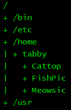
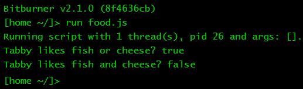
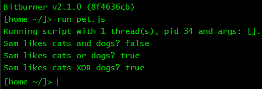

# Data, darta, dayta

This chapter will show you various ways to juggle basic data types in
JavaScript. A data type is something like a number or a character of the English
alphabet. When you have a sequence of characters, you get a data type called a
_string_ because you are stringing together a bunch of characters in a given
order. You will learn about another data type called _boolean_, whose only
values are either `true` or `false`. Numbers, strings, and booleans are among
the most fundamental building blocks upon which you construct your programs.

<!-- ====================================================================== -->

## Pick a number

Numbers in JavaScript are represented as floating point numbers. The integer 42
and the number 42.0 have the same representation. This is convenient for working
with numbers because you do not need to worry about whether a number is an
integer or floating point.

Underneath it all, JavaScript uses 64 bits to represent each number. Why do you
need to know that each number in JavaScript is 64-bit? Usually you do not need
to care that a number is 64-bit. However, if you are working on a program that
uses very large numbers, you would have to worry about whether 64 bits are
enough for your purpose. Use the following program to help you determine the
smallest and largest numbers that can be represented on your computer. My
computer has a 64-bit CPU and the results of the program running on my computer
are given in the comments. As you can see, the
[largest _safe_ integer](https://developer.mozilla.org/en-US/docs/Web/JavaScript/Reference/Global_Objects/Number/MAX_SAFE_INTEGER)
I can have on my computer is a little over 9 quadrillion and the
[smallest _safe_ integer](https://developer.mozilla.org/en-US/docs/Web/JavaScript/Reference/Global_Objects/Number/MIN_SAFE_INTEGER)
is the negative of the largest _safe_ integer.

```js
/**
 * Largest and smallest numbers in JavaScript.
 *
 * @param {NS} ns The Netscript API.
 */
export async function main(ns) {
    ns.tprint(Number.MIN_VALUE); // 5e-324
    ns.tprint(Number.MIN_SAFE_INTEGER); // -9007199254740991
    ns.tprint(Number.MAX_VALUE); // 1.7976931348623157e+308
    ns.tprint(Number.MAX_SAFE_INTEGER); // 9007199254740991
}
```

Look again closely at the comments in the program. Why is the letter `e` in two
of the numbers? A number written as `5e3` or `1.5e4` is using scientific
notation. The letter `e` here means "exponent", telling you the exponent to
which you must raise `10`. Consider the number `5e3`. You write down `5`. The
part `e3` tells you to raise `10` to the power of `3`, i.e. `1000`. Now multiply
`5` by `1000` to obtain `5,000`. Thus `5e3` is a compact representation of the
expanded form `5,000`. By way of another example, the number `1.5e4` means that
you write down `1.5`. Raise `10` to the power of `4` to get `10,000`. Now
multiply `1.5` by `10,000` and you have `15,000`, which is the expanded version
of `1.5e4`. As you can see, the `e` (or scientific) notation is handy whenever
you want a compact representation for a large or small number. Do you want to
write 7 million in your program as `7000000` or as `7e6`?

<!-- ====================================================================== -->

### Special numbers

JavaScript defines three special numbers:
[`NaN`](https://developer.mozilla.org/en-US/docs/Web/JavaScript/Reference/Global_Objects/NaN),
positive
[`Infinity`](https://developer.mozilla.org/en-US/docs/Web/JavaScript/Reference/Global_Objects/Infinity),
and
[`-Infinity`](https://developer.mozilla.org/en-US/docs/Web/JavaScript/Reference/Global_Objects/Infinity).
The symbol `NaN` means Not-A-Number. It results when a number conversion fails
or an operation cannot be performed on two numbers, among other reasons. For
example, you would get `NaN` if you try to evaluate `0 / 0`. In some programming
languages, attempting to divide zero by zero would result in the immediate halt
of your program. JavaScript is lenient, but you still need to guard against
having something as absurd as `0 / 0` in your programs. The symbol `NaN` can
also be accessed as
[`Number.NaN`](https://developer.mozilla.org/en-US/docs/Web/JavaScript/Reference/Global_Objects/Number/NaN).

Positive `Infinity` is defined in JavaScript as the number greater than every
other number in the language. Similarly, the special number `-Infinity` is
defined as the number smaller than every other number. These two numbers are
useful in certain situations, but do not expect them to behave like their formal
mathematical definitions. The special numbers `Infinity` and `-Infinity` are the
same as
[`Number.POSITIVE_INFINITY`](https://developer.mozilla.org/en-US/docs/Web/JavaScript/Reference/Global_Objects/Number/POSITIVE_INFINITY)
and
[`Number.NEGATIVE_INFINITY`](https://developer.mozilla.org/en-US/docs/Web/JavaScript/Reference/Global_Objects/Number/NEGATIVE_INFINITY),
respectively.

<!-- ====================================================================== -->

### Variables

A variable in programming languages is like a named box that can hold a value.
You place a specific value into the box. Anytime you want to use the value, you
reference the name of the box. One way to create a variable in JavaScript is by
using the keyword
[`let`](https://developer.mozilla.org/en-US/docs/Web/JavaScript/Reference/Statements/let).
Suppose you want to assign the number `7` to a variable whose name is `number`.
In JavaScript, you would do it like so:

```js
/**
 * Create a variable and print its value.
 *
 * @param {NS} ns The Netscript API.
 */
export async function main(ns) {
    let number = 7;
    ns.tprint(number);
}
```

Note the equal sign `=`. In JavaScript, and indeed in many other programming
languages, the equal sign `=` does not mean mathematical equality like you have
been taught in mathematics classes during your school days. Instead, the equal
sign `=` is used in JavaScript to mean "assign". The statement `let number = 7;`
in effect says, "Let's create a variable called `number` and assign the number
`7` to the variable." From hereon, whenever you want the numeric value `7`, you
can use the variable `number` instead.

The keyword `let` is flexible. Once you have declared a variable using `let`,
you can assign a value to that variable. Later on in your program, you can
assign a different value to that same variable. There are cases where you do not
want a variable to have a value other than the value you first assigned it. An
example is the number of days in a week, namely 7. The number of days in a week
remain the same no matter which country you are in, unless you happen to be in a
country that uses a different kind of calendar. In JavaScript, how do you
declare as constant a variable that holds the number of days in a week? Do so
using the keyword
[`const`](https://developer.mozilla.org/en-US/docs/Web/JavaScript/Reference/Statements/const),
as shown in the script `week.js` below.

```js
/**
 * week.js
 *
 * A variable whose value can be changed and
 * another variable whose value cannot be changed.
 *
 * @param {NS} ns The Netscript API.
 */
export async function main(ns) {
    let weekend = 2;
    weekend = 3;
    const daysInWeek = 7;
    ns.tprint(weekend);
    ns.tprint(daysInWeek);
    // daysInWeek = 5;
}
```

<!-- ====================================================================== -->

### Exercises

> **Exercise 1.** Write the number `420,000,000` in terms of scientific
> notation.
>
> **Exercise 2.** Write the expanded form of the number `9.6e1`.
>
> **Exercise 3.** Why is the number `5e-3` different from `-5e3`?
>
> **Exercise 4.** [MDN Web Docs](https://developer.mozilla.org/) has up-to-date
> documentation about JavaScript. You should be consulting the
> [JavaScript reference](https://developer.mozilla.org/en-US/docs/Web/JavaScript/Reference)
> on MDN as you learn JavaScript. Spend some time to browse through the
> reference now. Do not worry if everything is incomprehensible at the moment.
> For now, it is more important that you are familiar with the structure of the
> reference rather than its contents.
>
> **Exercise 5.** Read more about numbers in JavaScript
> [here](https://developer.mozilla.org/en-US/docs/Web/JavaScript/Reference/Global_Objects/Number).
>
> **Exercise 6.** JavaScript also allows you to handle huge integers that do not
> fit within 64 bits. Browse through the documentation of
> [`BigInt`](https://developer.mozilla.org/en-US/docs/Web/JavaScript/Reference/Global_Objects/BigInt)
> to see what JavaScript has to offer in terms of very large integers.
>
> **Exercise 7.** Create a script called `age.js`. Assign your age to a variable
> and print the value of the variable to the terminal.
>
> **Exercise 8.** Refer to the script `week.js` above. Uncomment the line

```js
// daysInWeek = 5;
```

> Save the script and run it again. What do you get as output? Why do you get
> such output?
>
> **Exercise 9.** Apart from using
> [`let`](https://developer.mozilla.org/en-US/docs/Web/JavaScript/Reference/Statements/let)
> and
> [`const`](https://developer.mozilla.org/en-US/docs/Web/JavaScript/Reference/Statements/const),
> a third way to declare a variable is by using the keyword
> [`var`](https://developer.mozilla.org/en-US/docs/Web/JavaScript/Reference/Statements/var).
> You will most likely see `var` being used in JavaScript code sooner or later.
> Avoid using `var` in any JavaScript code you write. Stick to `let` and `const`
> as much as possible. Read
> [this article](https://medium.com/swlh/the-difference-of-var-vs-let-vs-const-in-javascript-abe37e214d66)
> to learn more about the differences between `let`, `const`, and `var`.
>
> **Exercise 10.** The operator
> [`typeof`](https://developer.mozilla.org/en-US/docs/Web/JavaScript/Reference/Operators/typeof)
> allows you to query the data type of a variable or whatever value you give to
> the operator. Run the script below and note the output printed to the
> terminal. Why does the variable `n` have the data type `number`? Edit the
> script to print the data type of each of `NaN` and `-Infinity`.

```js
/**
 * The data type of a variable.
 *
 * @param {NS} ns The Netscript API.
 */
export async function main(ns) {
    const n = 42;
    ns.tprint(typeof n);
    ns.tprint(typeof Infinity);
}
```

<!-- ====================================================================== -->

## String me along

A _string_ is a sequence of characters. JavaScript gives you various ways to
create a string, some common methods being:

1. Double quotation marks. Delimit a string by using the double quotation mark
   symbol, i.e. `"`. For example, `"This string uses double quotation marks."`
1. Single quotation marks. Use the single quotation mark symbol, i.e. `'`, to
   delimit a string. An example is, `'This string uses single quotation marks.'`
1. Backticks. The backtick symbol `` ` `` works similarly to the single and
   double quotation marks. However, the backtick allows you to create more
   flexible strings when you use variables to customize your strings.

The following program uses the above techniques to create various strings.

```js
/**
 * Various ways to create strings.
 *
 * @param {NS} ns The Netscript API.
 */
export async function main(ns) {
    let pet = "cat";
    let age = 2;
    ns.tprint("I'm Sam.");
    ns.tprint('I have a cat called "Tabby".');
    ns.tprint(`My ${pet} is ${age} years old.`);
}
```

The above program shows that you can mix single and double quotation marks,
usually under special circumstances. If your string has an apostrophe or a
single quotation mark, as in `I'm`, then the string should be delimited with
double quotation marks. You can also write `"I'm Sam."` as `'I\'m Sam.'`; notice
the backslash `\`. I think the version `"I'm Sam."` is more readable than
`'I\'m Sam.'`. Remember, you are also writing JavaScript code for other humans
to read. A word in your string might be enclosed within double quotation marks,
e.g. `"Tabby"`, in which case delimit your string using single quotation marks.
You can also use backslash to get `"I have a cat called \"Tabby\"."`, but I
think this is not as readable as `'I have a cat called "Tabby".'`. Finally, use
backticks to customize your strings. You can insert the value of a variable
inside a string provided the string is delimited with backticks. Use the
placeholder `${variableName}` to insert the value of a variable, as demonstrated
in the above program. Using backticks in this manner is an example of a general
technique called _template literal_.

<!-- ====================================================================== -->

### Cons and cat

Next, let's discuss another string problem. How to concatenate, or join
together, multiple strings? Suppose you have a variable called `firstName` that
holds the string `"Tabby"`. You also have a variable called `lastName` that
holds the string `"Whiskers"`. How would you use both variables to concatenate
the strings they hold into a new string? One way is to use the mathematical
operator `+` to join the two strings, taking care to insert a space between the
first name and the last name. A second technique consists of using template
literal as discussed above. A third technique is to use the string method
[`concat()`](https://developer.mozilla.org/en-US/docs/Web/JavaScript/Reference/Global_Objects/String/concat).
Every string in JavaScript has this method. The following program uses the above
techniques to concatenate various strings.

```js
/**
 * Various ways to concatenate strings.
 *
 * @param {NS} ns The Netscript API.
 */
export async function main(ns) {
    const firstName = "Tabby";
    const lastName = "Whiskers";
    const a = firstName + " " + lastName; // Use + operator.
    const b = `${firstName} ${lastName}`; // Template literal.
    const c = firstName.concat(" ", lastName); // Method concat()
    ns.tprint(a);
    ns.tprint(b);
    ns.tprint(c);
}
```

Why so many ways to join multiple strings together? Each technique is useful in
some circumstances. For example, template literal is often used when you want to
create a custom string. The method
[`concat()`](https://developer.mozilla.org/en-US/docs/Web/JavaScript/Reference/Global_Objects/String/concat)
is used when you want to concatenate multiple strings together, possibly tens or
hundreds of strings. There is a fourth technique that is better suited to
concatenating multiple strings, but we will postpone its discussion to later in
the tutorial.

<!-- ====================================================================== -->

### Exercises

> **Exercise 1.** Write a program to introduce yourself. Use variables and
> template literals to create strings that contain your full name, age, and
> favourite food. Print the strings to the terminal.
>
> **Exercise 2.** Run the program below. What are the output of `typeof`?
> Explain why you got such output.

```js
/**
 * What's my type?
 *
 * @param {NS} ns The Netscript API.
 */
export async function main(ns) {
    const s = "Tabby";
    ns.tprint(typeof s);
    ns.tprint(typeof "");
}
```

> **Exercise 3.** The newline character, written using a backslash as `\n`, can
> be used to break a string into multiple lines. The break only occurs when you
> print the string. Run the program below to see what you would get. Add two
> more items to the shopping list: dates and eggs. Insert the items into the
> same string and ensure each item appears on its own line when printed.

```js
/**
 * shopping.js
 *
 * Multiline string.
 *
 * @param {NS} ns The Netscript API.
 */
export async function main(ns) {
    const shoppingList = "\n1. Apples\n2. Bananas\n3. Cherries";
    ns.tprint(shoppingList);
}
```

> **Exercise 4.** Read more about JavaScript strings
> [here](https://developer.mozilla.org/en-US/docs/Web/JavaScript/Reference/Global_Objects/String).
>
> **Exercise 5.** Each string has the method
> [`toLowerCase()`](https://developer.mozilla.org/en-US/docs/Web/JavaScript/Reference/Global_Objects/String/toLowerCase),
> which is used to convert all characters in the string to lower case. Use the
> method to convert the string `"This is A String."` to lower case. Print your
> result to the terminal.
>
> **Exercise 6.** The function
> [`ns.tprint()`](https://github.com/bitburner-official/bitburner-src/blob/dev/markdown/bitburner.ns.tprint.md)
> first prints the name of the script that calls the function, followed by
> whatever you tell it to output to the terminal. Sometimes you do not want to
> print the script name because doing so messes up the formatting of your
> string. Refer to the script `shopping.js` from Exercise 2. We used
> `ns.tprint()` and `\n` to properly format our shopping list. Had we removed
> the very first newline character `\n` from our string, the resulting shopping
> list would be out of alignment when output to the terminal. Use the function
> [`ns.tprintf()`](https://github.com/bitburner-official/bitburner-src/blob/dev/markdown/bitburner.ns.tprintf.md)
> instead. Change the script `shopping.js` to use the function `ns.tprintf()`.
> Remember to remove the leading newline character.
>
> **Exercise 7.** Tabby Whiskers uses a Linux operating system called Tabian.
> This is what Tabby's directory tree looks like:
>
> 
>
> Write a program to print Tabby's directory tree.
>
> **Exercise 8.** Use emoji and colours to spice up your terminal output. Colour
> effect is achieved by
> [ANSI escape code](https://en.wikipedia.org/wiki/ANSI_escape_code). Suppose
> you want to colour the string `"Tabby"` as magenta. Use the escape code
> `\u001b[35m` (the sequence for magenta) to begin the colouring. End the
> colouring with the escape code `\u001b[0m`, which resets the effect of the
> previous escape code. The colouring effect is achieved as the string
> `"\u001b[35mTabby\u001b[0m"`. Emoji is much simpler; insert the emoji you want
> in your string. The following script provides a profile of Tabby.

```js
/**
 * tabby-profile.js
 *
 * A profile of Tabby the cat.
 *
 * @param {NS} ns The Netscript API.
 */
export async function main(ns) {
    const cyan = "\u001b[36m";
    const red = "\u001b[31m";
    const reset = "\u001b[0m";
    const name = "Name: Tabby Whiskers";
    const pic = "Pic: 🐱";
    const like = `${cyan}Likes${reset}: fish`;
    const hate = "Hates: broccoli";
    ns.tprintf(`${name}\n${pic}\n${like}\n${hate}`);
}
```

> Colour the string `"Hates"` as red. Tabby likes to play with a yarn ball. Add
> Tabby's favourite toy to its profile. Read more about ANSI escape code for
> colours
> [here](https://www.lihaoyi.com/post/BuildyourownCommandLinewithANSIescapecodes.html)
> and [here](https://gist.github.com/fnky/458719343aabd01cfb17a3a4f7296797).
>
> **Exercise 9.** Each string in JavaScript has the property
> [`length`](https://developer.mozilla.org/en-US/docs/Web/JavaScript/Reference/Global_Objects/String/length),
> which tells you the number of characters in the string, including whitespace
> characters. To count the number of characters in the string
> `"Tabby Whiskers"`, use the following program:

```js
/**
 * How many characters are in Tabby's full name?
 *
 * @param {NS} ns The Netscript API.
 */
export async function main(ns) {
    const name = "Tabby Whiskers";
    ns.tprintf(name.length);
}
```

> In fact, you can shorten the program to the one-liner
> `ns.tprintf("Tabby Whiskers".length);`. Write a program to count the number of
> letters in the word `supercalifragilisticexpialidocious`. Use your program to
> calculate the number of characters in the sentence
> `The quick brown fox jumps over the lazy dog.`.

<!-- ====================================================================== -->

## Smooth operator

The usual mathematical operators you learnt in school can be used in JavaScript
to perform various calculations. Here is a list of the usual suspects together
with their corresponding symbols in JavaScript:

1. _Addition._ Add two numbers by using the addition operator `+`.
1. _Subtraction._ Take one number from another number by using the subtraction
   operator `-`.
1. _Multiplication._ The usual multiplication symbol is $\times$, but in
   JavaScript you use the asterisk symbol `*`.
1. _Division._ Use the forward slash symbol `/` to divide one number by another
   number.

The usual order of operation you learnt in school carries over to JavaScript.
You might prefer to make your intention clear by enclosing various parts of an
expression within parentheses. Consider the following program.

```js
/**
 * Doing arithmetics in JavaScript.
 *
 * @param {NS} ns The Netscript API.
 */
export async function main(ns) {
    const a = 1 - 2 * 3; // 1 - (2 * 3) = -5
    const b = 1 + 6 / 2; // 1 + (6 / 2) = 4
    const c = 1 - (8 / 2) * 2; // 1 - 8 / 2 * 2 = -7
    const d = (1 + 2) / (4 - 3); // 3 / 1 = 3
    ns.tprint(a);
    ns.tprint(b);
    ns.tprint(c);
    ns.tprint(d);
}
```

Recall from the section [_Cons and cat_](#cons-and-cat) that you have already
been using the addition operator `+` to "add" two strings together. In the
context of strings, the operator `+` means concatenation of strings. However, if
you have numbers on either sides of the symbol `+` as in the expression `1 + 2`,
then the operator `+` means mathematical addition. What would happen if an
operand of `+` is a string while the other operand is a number as in the
expression `"abc" + 2`? JavaScript would convert the number `2` to a string,
then concatenate `"abc"` with `"2"`.

JavaScript has two other mathematical operators:

1. _Remainder._ The remainder operator (also known as the modulo operator) is
   the percent symbol `%`. The operator gives you the remainder upon dividing
   one number by another number. For example, $4 / 2 = 2$ because 2 divides
   evenly into 4 with zero remainder. You would expect the JavaScript expression
   `4 % 2` to give you 0, which is correct. Now 3 does not evenly divide into 4
   because the mathematical expression $4 / 3$ does not result in an integer.
   How would you calculate the remainder in this case? The remainder is 1, which
   can be verified with the JavaScript expression `4 % 3`.
1. _Exponentiation._ Exponentiation is about raising a number to a power. The
   square of 4 can be written as the mathematical expression $4 \times 4 = 4^2$.
   You write the latter expression in JavaScript as `4**2`, where you use the
   multiplication symbol `*` twice. Why would JavaScript not use the caret
   symbol `^` for exponentiation? The reason is that JavaScript already reserves
   the symbol `^` for a different purpose. Read more about the
   [symbol `^` here](https://developer.mozilla.org/en-US/docs/Web/JavaScript/Reference/Operators/Bitwise_XOR).

OK, so you can use `**` to mean exponentiation. Can a similar thing be done with
the addition, subtraction, and division operators? Yes to the addition and
subtraction operators, but no to the division operator. You already know that
`//` is used to delimit a single line comment. The symbols `++` and `--` are the
increment and decrement operators, respectively. Suppose you have a variable
declared like so: `let n = 0;`. Later in your program, you might want to add 1
to `n`. You can certainly perform the addition like this: `n = n + 1`.
JavaScript allows you to write the code more compactly as `n++`, which is a
shorthand for `n = n + 1`. Similarly, you can decrement the value of `n` by 1 as
`n = n - 1` or use the shorthand notation `n--`. Time for some more facts about
Tabby the cat.

```js
/**
 * tabby-facts.js
 *
 * Facts about Tabby.
 *
 * @param {NS} ns The Netscript API.
 */
export async function main(ns) {
    let age = 2;
    let can = 5;
    ns.tprintf(`Tabby is ${age} years old.`);
    age++;
    ns.tprintf(`Tabby will soon be ${age} years old.`);
    ns.tprintf(`Tabby had ${can} cans of food.`);
    can--;
    ns.tprintf(`After eating 1 can, Tabby now has ${can} cans.`);
}
```

<!-- ====================================================================== -->

### Exercises

> **Exercise 1.** A pizza is cut into 7 equal slices. You share the pizza with 2
> friends. Each person must have the same number of slices. Write a program to
> calculate the number of slices each person can have. Extend your program to
> calculate the number of slices remaining after sharing the pizza equally
> amongst yourself and your friends.
>
> **Exercise 2.** How many whole weeks can there be in a full year? How many
> left over days that do not form a whole week? Write a program to calculate
> your answer.
>
> **Exercise 3.** If `++` increments a numeric variable by 1, is the expression
> `2++` valid in JavaScript? Why or why not? Similarly, explain why `3--` is or
> is not valid JavaScript code.
>
> **Exercise 4.** The meaning of the increment operator `++` depends on whether
> it is placed on the left or right side of its operand. Suppose you declare a
> variable as `let k = 3;`. You can increment `k` by 1 like this `++k`
> (pre-increment) or like this `k++` (post-increment), but the effect can be
> different and subtle. The pre-increment expression `++k` means you first
> increment `k` by 1 then return the result, i.e. 4. In contrast, the
> post-increment expression `k++` means you return the current value of `k`
> (i.e. 3), then increment `k` by 1. A similar comment applies to the decrement
> operator `--`. In the program below, the values of `a` and `b` are different,
> even though we incremented the same variable.

```js
/**
 * Pre- and post-increment.
 *
 * @param {NS} ns The Netscript API.
 */
export async function main(ns) {
    let k = 3;
    const a = ++k;
    k = 3;
    const b = k++;
    ns.tprint(`Pre-increment k: ${a}`);
    ns.tprint(`Post-increment k: ${b}`);
}
```

> In the script `tabby-facts.js` above, remove the lines `age++;` and `can--;`.
> Replace each print statement with an appropriate pre-increment or
> post-increment expression, or no replacement at all.
>
> **Exercise 5.** The increment expression `k++` is shorthand for `k = k + 1`.
> Is there a similar shorthand for something like `k = k + 3`? You can replace
> the expression `k = k + 3` with the shorthand `k += 3`. In general, an
> expression such as `k += n` means you first add `k` and `n` together, then
> assign the result to `k`. Similarly, the expression `k = k - n` can be
> replaced with the shorthand `k -= n`. The expression `k = k * n` can be
> replaced with `k *= n`. The expression `k = k / n` can be written more
> succinctly as `k /= n`. Modify the script `tabby-facts.js` above to use one or
> more of the operators discussed in this exercise.
>
> **Exercise 6.** Refer to
> [this page](https://developer.mozilla.org/en-US/docs/Web/JavaScript/Reference/Global_Objects/Math)
> for details about mathematical calculations you can do in JavaScript. For
> example, the function
> [`Math.pow()`](https://developer.mozilla.org/en-US/docs/Web/JavaScript/Reference/Global_Objects/Math/pow)
> allows you to raise a number to a specified exponent. Instead of the
> expression `3**2` to calculate the square of 3, use the expression
> `Math.pow(3, 2)`. Use the function `Math.pow()` to calculate the square of 4.
> Use the function `Math.pow()` to calculate the _square root_ of 25.
>
> **Exercise 7.** The function
> [`Math.floor()`](https://developer.mozilla.org/en-US/docs/Web/JavaScript/Reference/Global_Objects/Math/floor)
> gives you the integer part of a number and ignores the fractional part. For
> example, given the number 2.5 the expression `Math.floor(2.5)` would return 2
> because 2 is the integer part. Use `Math.floor()` in your solutions to
> Exercises 1 and 2 above.
>
> **Exercise 8.** The function
> [`Math.random()`](https://developer.mozilla.org/en-US/docs/Web/JavaScript/Reference/Global_Objects/Math/random)
> returns a random floating point number less than one, but equal to or greater
> than zero. The output of `Math.random()` is not really random _per se_ and
> should not be used for cryptographic purposes. If you multiply the random
> floating point number by 100 and pass the result to the function
> `Math.floor()`, you should obtain a random integer at most 100. Write a
> program to implement the above technique for generating a random integer at
> most 100.

<!-- ====================================================================== -->

## Bool-urns

> Roy: (Singing) We don't need no education.\
> Moss: Yes you do. You've just used a double negative.\
> -- _The IT Crowd_, season 1, episode 4, 2006

Do you like samurai? Do you like pizza? Do you like cats? If you answer yes to
all three questions, you might like
[Samurai Pizza Cats](https://en.wikipedia.org/wiki/Samurai_Pizza_Cats). Do you
also like banana? Perhaps you might be interested in
[Bananya](https://en.wikipedia.org/wiki/Bananya). Questions such as the above
often require a yes/no answer. Yes means true, you prefer something. No means
false, you dislike something. Questions or statements that can be answered with
yes/no or true/false are said to have _boolean_ values. The two boolean values
in JavaScript are `true` and `false`.

What else can you do with boolean values? A simple operation is to use the
boolean operator `!` (an exclamation mark) to negate a boolean value, thus
resulting in the opposite value. The result of `!true` is `false` because the
opposite of `true` is `false`. As you might have already guessed, the result of
`!false` is `true`.

Given a bunch of boolean values, you can use the JavaScript boolean operators
`||` and `&&` to calculate boolean results. The operator `||` means "or", i.e.
logical disjunction. In everyday English usage, the word "or" means "either this
or that". In computer programming, "or" means "this or that or both". The
following table should help to clarify the meaning of `||` and its effect when
given two boolean values.

| `\|\|`  | `false` | `true` |
| ------- | ------- | ------ |
| `false` | `false` | `true` |
| `true`  | `true`  | `true` |

From the above table, the result of `false || true` is `true`, so is
`true || true`. The one and only time when `||` returns `false` is when both
operands are `false`. Take a moment to use the above table and work through the
output of the following program. Note that in each template literal below, the
result of a boolean expression is first calculated, then substituted into the
appropriate location within the output string.

```js
/**
 * bool-or.js
 *
 * Boolean or.
 *
 * @param {NS} ns The Netscript API.
 */
export async function main(ns) {
    const coffee = true;
    const tea = false;
    const water = true;
    const beer = false;
    ns.tprintf(`Coffee or tea? ${coffee || tea}`);
    ns.tprintf(`Tea or water? ${tea || water}`);
    ns.tprintf(`Tea or beer? ${tea || beer}`);
}
```

The boolean operator `&&` means "and", i.e. logical conjunction. Its result is
`true` provided that both operands are `true`. Its result is `false` for all
other cases. The table below helps to clarify the effect of `&&`.

| `&&`    | `false` | `true`  |
| ------- | ------- | ------- |
| `false` | `false` | `false` |
| `true`  | `false` | `true`  |

Unlike the expression `true || false`, the result of `true && false` is `false`.
The only time when `&&` returns `true` is the expression `true && true`. Again,
take some time to work through the boolean results of the following program.

```js
/**
 * bool-and.js
 *
 * Boolean and.
 *
 * @param {NS} ns The Netscript API.
 */
export async function main(ns) {
    const coffee = true;
    const tea = false;
    const water = true;
    const beer = false;
    ns.tprintf(`Coffee and tea? ${coffee && tea}`);
    ns.tprintf(`Coffee and water? ${coffee && water}`);
    ns.tprintf(`Tea and beer? ${tea && beer}`);
}
```

<!-- ====================================================================== -->

### Exercises

> **Exercise 1.** Simplify the statement: "I will not not read anymore."
>
> **Exercise 2.** What's the output of the following program? Explain why you
> got such output.

```js
/**
 * What's my type?
 *
 * @param {NS} ns The Netscript API.
 */
export async function main(ns) {
    ns.tprint(typeof true);
    ns.tprint(typeof false);
}
```

> **Exercise 3.** Run the following program. Modify the program so the
> expression `likeCat && likeTiger` returns `false`.

```js
/**
 * Sam's pets.
 *
 * @param {NS} ns The Netscript API.
 */
export async function main(ns) {
    const likeCat = true;
    const likeDog = true;
    const likeTiger = true;
    const likeWolf = false;
    ns.tprintf(`Sam likes cats and dogs? ${likeCat && likeDog}`);
    ns.tprintf(`Sam likes tiger or wolf? ${likeTiger || likeWolf}`);
    ns.tprintf(`Sam likes cat or tiger? ${likeCat || likeTiger}`);
    ns.tprintf(`Sam likes cat and tiger? ${likeCat && likeTiger}`);
}
```

> **Exercise 4.** What is the back of your back?
>
> **Exercise 5.** Determine the output of the following program.

```js
/**
 * Negate and negate again.
 *
 * @param {NS} ns The Netscript API.
 */
export async function main(ns) {
    const likeCat = true;
    ns.tprintf(`${!!likeCat}`);
}
```

> **Exercise 6.** Examine the following image. Determine which food Tabby
> dislikes. Write a program that uses boolean operators to achieve the same
> output as in the image.
>
> 
>
> **Exercise 7.** In JavaScript, the number `0` also means `false`. Similarly,
> the number `1` means `true`. When using boolean operators on these two
> numbers, the result is either `0` or `1`, not `false` or `true`. For example,
> the result of the expression `0 || 1` is `1`, which we know means `true`. You
> can use double negation to convert `0` or `1` to their corresponding boolean
> values. The expression `!!0` now evaluates to `false` and `!!1` evaluates to
> `true`. In the program `bool-or.js` above, replace `false` and `true` with `0`
> and `1`, respectively. Use double negation to convert your results to their
> boolean values. Repeat the exercise for the program `bool-and.js`.
>
> **Exercise 8.** The word "or" in everyday English means, "Either this or that,
> but not both." In computer programming, this meaning of "or" is called
> _exclusive or_, often abbreviated as XOR. JavaScript does not have a boolean
> operator for XOR _per se_. However, you can achieve the same effect by
> combining `||` with `&&`. The XOR of two boolean variables `a` and `b` is
> defined as the expression

```js
(a || b) && !(a && b);
```

> Fortunately, you do not need to use the above expression whenever you want to
> calculate the XOR of two boolean values. JavaScript has the
> [_bitwise_ operator `^`](https://developer.mozilla.org/en-US/docs/Web/JavaScript/Reference/Operators/Bitwise_XOR),
> which is XOR defined for the binary values `0` and `1`. Write a program that
> uses the bitwise XOR operator `^` to achieve the same output as shown in the
> image below.
>
> 

<!-- ====================================================================== -->

## Compare the pair

Boolean values commonly arise when you need to compare strings, numbers, or
something else. Is the number 1 less than 2? Of course the expression $1 < 2$ is
true. Here are some more mathematics facts:

```js
/**
 * Comparing numbers.
 *
 * @param {NS} ns The Netscript API.
 */
export async function main(ns) {
    const a = 1;
    const b = 2;
    ns.tprintf(`${a} < ${b}? ${a < b}`);
    ns.tprintf(`${a} > ${b}? ${a > b}`);
    ns.tprintf(`${a} <= ${b}? ${a <= b}`);
    ns.tprintf(`${a} >= ${b}? ${a >= b}`);
    ns.tprintf(`${a} = ${b}? ${a === b}`);
    ns.tprintf(`${a} != ${b}? ${a !== b}`);
}
```

Carefully examine the above program. Why the triple equal signs `===`? The
operator `===` is used in JavaScript to mean strict equality. JavaScript also
uses the operator `==` (double equal signs) to compare numbers, but the
comparison is looser and not as strict as `===`. For example, JavaScript allows
you to compare a number with a string as in the expression `2 == "2"`, which is
valid JavaScript code and returns `true`. Strictly speaking, the number `2` is
different from its string representation `"2"`. The expression `2 === "2"`
returns `false`, which is what you would expect because a number is not the same
as a string. Avoid using `==` as much as possible. Stick to the strict equality
operator `===`. Similarly, JavaScript uses the operator `!==` to decide whether
two numbers are different. There is the looser version `!=`, but you should use
`!==` as much as possible.

Does JavaScript allow you to use the above operators to compare strings? Of
course. Use `===` to determine whether two strings are the same. Similarly, use
`!==` to see whether two strings are different.

<!-- ====================================================================== -->

### Exercises

> **Exercise 1.** Read more about loose and strict equality
> [here](https://developer.mozilla.org/en-US/docs/Web/JavaScript/Equality_comparisons_and_sameness).
>
> **Exercise 2.** Explain why the program below gives you different answers.

```js
/**
 * Same or different?
 *
 * @param {NS} ns The Netscript API.
 */
export async function main(ns) {
    const n = 2;
    const a = n != "2";
    const b = n !== "2";
    ns.tprintf(`${n} != "2"? ${a}`);
    ns.tprintf(`${n} !== "2"? ${b}`);
}
```

> **Exercise 3.** Why are the strings `"Meow"` and `"meow"` different? Write a
> program to convert either or both strings so the resulting strings compare
> equal according to `===`.
>
> **Exercise 4.** The number `123` is not strictly the same as the string
> `"123"`. However, you can use the JavaScript function
> [`parseInt(string, radix)`](https://developer.mozilla.org/en-US/docs/Web/JavaScript/Reference/Global_Objects/parseInt)
> to convert `"123"` to an integer. Replace `string` with `"123"` and replace
> `radix` with the base of the number system you want to use. For now, you want
> to interpret `"123"` as an integer according to the decimal number system,
> hence replace `radix` with `10` to mean the decimal number system. The code
> `parseInt("123", 10)` will convert `"123"` to an integer. Furthermore, if a
> string such as `"123.45"` can be interpreted as a floating point number, you
> can use the function
> [`parseFloat(string)`](https://developer.mozilla.org/en-US/docs/Web/JavaScript/Reference/Global_Objects/parseFloat)
> to convert the string to a floating point number. Using `parseFloat()` is
> simpler than using `parseInt()` because `parseFloat()` always uses the decimal
> number system. Modify the program `parse-num.js` below so the relevant values
> compare equal according to `===`.

```js
/**
 * parse-num.js
 *
 * Same or different?
 *
 * @param {NS} ns The Netscript API.
 */
export async function main(ns) {
    const a = 42;
    const b = 42.3;
    const as = "42";
    const bs = "42.3";
    ns.tprintf(`${a} = ${as}? ${a === as}`);
    ns.tprintf(`${b} = ${bs}? ${b === bs}`);
}
```

> **Exercise 5.** The function
> [`Number()`](https://developer.mozilla.org/en-US/docs/Web/JavaScript/Reference/Global_Objects/Number)
> provides a convenient way to convert a number from string representation to
> the number data type. Repeat Exercise 5, but using `Number()` only.
>
> **Exercise 6.** Instead of converting `"123"` to a number so it would compare
> equal to `123`, you can use the code
> [`String(n)`](https://developer.mozilla.org/en-US/docs/Web/JavaScript/Reference/Global_Objects/String)
> to convert the number `123` to a string and then perform the comparison. For
> example, `123` would be converted to a string like so: `String(123)`. Use
> `String()` to modify the program `parse-num.js` above so the relevant values
> would compare equal according to `===`.
>
> **Exercise 7.** The inequality operators `<`, `>`, `<=`, and `>=` also work
> with characters of the English alphabet. Just like the integers have an
> ordering to tell you that $1 < 2$ holds true, characters of the English
> alphabet have an ordering as well, i.e. alphabetic or _lexicographic_
> ordering. The letter "a" always comes before "b" and JavaScript can confirm
> this dictionary ordering if you run the code `"a" < "b"`. Here, the operator
> `<` means "precede". The expression `"a" < "b"` can be read as: Does the
> letter "a" come before "b"? Note that in JavaScript, an uppercase letter
> always precedes any lowercase letter. Modify the program below so the result
> of the operator `<` is `true`. Why does the expression
> `"aardvark" < "Aardvark"` return `false`?

```js
/**
 * A small dictionary.
 *
 * @param {NS} ns The Netscript API.
 */
export async function main(ns) {
    const a = "aardvark";
    const b = "armadillo";
    const c = "aardwolf";
    const d = "Aardvark";
    ns.tprintf(`${b} < ${a}? ${b < a}`);
    ns.tprintf(`${c} < ${a}? ${c < a}`);
    ns.tprintf(`${b} < ${c}? ${b < c}`);
    ns.tprintf(`${a} < ${d}? ${a < d}`);
}
```

> **Exercise 8.** Two strings might have the same length, but that does not mean
> they are the same string. Each character must occur at the same position in
> both strings. Two strings can be similar if they have the same length and
> characters in corresponding positions might differ by lowercase or uppercase.
> Write a program to help you determine which of the following strings are
> strictly the same and which are similar: `"n00dles"`, `"noodles"`,
> `"N00dles"`.

[[TOC](../README.md "Table of Contents")] [[Previous](hello.md "Hello, world")]
[[Next](decide.md "Decision, decision")]

[](http://creativecommons.org/licenses/by-nc-sa/4.0/)
