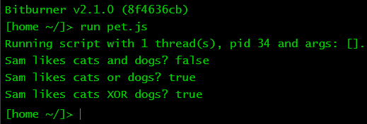

# Bool-urns

<!-- prettier-ignore -->
> Roy: (Singing) We don't need no education.<br>
> Moss: Yes you do. You've just used a double negative.<br>
> -- _The IT Crowd_, season 1, episode 4, 2006

Do you like samurai? Do you like pizza? Do you like cats? If you answer yes to
all three questions, you might like
[Samurai Pizza Cats](https://en.wikipedia.org/wiki/Samurai_Pizza_Cats). Do you
also like banana? Perhaps you might be interested in
[Bananya](https://en.wikipedia.org/wiki/Bananya). Questions such as the above
often require a yes/no answer. Yes means true, you prefer something. No means
false, you dislike something. Questions or statements that can be answered with
yes/no or true/false are said to have _boolean_ values. The two boolean values
in JavaScript are `true` and `false`.

What else can you do with boolean values? A simple operation is to use the
boolean operator `!` (an exclamation mark) to negate a boolean value, thus
resulting in the opposite value. The result of `!true` is `false` because the
opposite of `true` is `false`. As you might have already guessed, the result of
`!false` is `true`.

Given a bunch of boolean values, you can use the JavaScript boolean operators
`||` and `&&` to calculate boolean results. The operator `||` means "or", i.e.
logical disjunction. In everyday English usage, the word "or" means "either this
or that". In computer programming, "or" means "this or that or both". The
following table should help to clarify the meaning of `||` and its effect when
given two boolean values. The table below uses `OR` instead of `||` because
HonKit cannot properly convert `||` when used within a Markdown table.

| `OR`    | `false` | `true` |
| :------ | :------ | :----- |
| `false` | `false` | `true` |
| `true`  | `true`  | `true` |

From the above table, the result of `false || true` is `true`, so is
`true || true`. The one and only time when `||` returns `false` is when both
operands are `false`. Take a moment to use the above table and work through the
output of the following program. Note that in each template literal below, the
result of a boolean expression is first calculated, then substituted into the
appropriate location within the output string.

```js
// bool-or.js

/**
 * Boolean or.
 *
 * @param {NS} ns The Netscript API.
 */
export async function main(ns) {
    const coffee = true;
    const tea = false;
    const water = true;
    const beer = false;
    ns.tprintf(`Coffee or tea? ${coffee || tea}`);
    ns.tprintf(`Tea or water? ${tea || water}`);
    ns.tprintf(`Tea or beer? ${tea || beer}`);
}
```

The boolean operator `&&` means "and", i.e. logical conjunction. Its result is
`true` provided that both operands are `true`. Its result is `false` for all
other cases. The table below helps to clarify the effect of `&&`.

| `&&`    | `false` | `true`  |
| :------ | :------ | :------ |
| `false` | `false` | `false` |
| `true`  | `false` | `true`  |

Unlike the expression `true || false`, the result of `true && false` is `false`.
The only time when `&&` returns `true` is the expression `true && true`. Again,
take some time to work through the boolean results of the following program.

```js
// bool-and.js

/**
 * Boolean and.
 *
 * @param {NS} ns The Netscript API.
 */
export async function main(ns) {
    const coffee = true;
    const tea = false;
    const water = true;
    const beer = false;
    ns.tprintf(`Coffee and tea? ${coffee && tea}`);
    ns.tprintf(`Coffee and water? ${coffee && water}`);
    ns.tprintf(`Tea and beer? ${tea && beer}`);
}
```

<!-- ====================================================================== -->

## Exercises

**Exercise 1.** Simplify the statement: "I will not not read anymore."

**Exercise 2.** What's the output of the following program? Explain why you got
such output.

```js
/**
 * What's my type?
 *
 * @param {NS} ns The Netscript API.
 */
export async function main(ns) {
    ns.tprint(typeof true);
    ns.tprint(typeof false);
}
```

**Exercise 3.** Run the following program. Modify the program so the expression
`likeCat && likeTiger` returns `false`.

```js
/**
 * Sam's pets.
 *
 * @param {NS} ns The Netscript API.
 */
export async function main(ns) {
    const likeCat = true;
    const likeDog = true;
    const likeTiger = true;
    const likeWolf = false;
    ns.tprintf(`Sam likes cats and dogs? ${likeCat && likeDog}`);
    ns.tprintf(`Sam likes tiger or wolf? ${likeTiger || likeWolf}`);
    ns.tprintf(`Sam likes cat or tiger? ${likeCat || likeTiger}`);
    ns.tprintf(`Sam likes cat and tiger? ${likeCat && likeTiger}`);
}
```

**Exercise 4.** What is the back of your back?

**Exercise 5.** Determine the output of the following program.

```js
/**
 * Negate and negate again.
 *
 * @param {NS} ns The Netscript API.
 */
export async function main(ns) {
    const likeCat = true;
    ns.tprintf(`${!!likeCat}`);
}
```

**Exercise 6.** Examine the following image. Determine which food Tabby
dislikes. Write a program that uses boolean operators to achieve the same output
as in the image.


**Exercise 7.** In JavaScript, the number `0` also means `false`. Similarly, the
number `1` means `true`. When using boolean operators on these two numbers, the
result is either `0` or `1`, not `false` or `true`. For example, the result of
the expression `0 || 1` is `1`, which we know means `true`. You can use double
negation to convert `0` or `1` to their corresponding boolean values. The
expression `!!0` now evaluates to `false` and `!!1` evaluates to `true`. In the
program `bool-or.js` above, replace `false` and `true` with `0` and `1`,
respectively. Use double negation to convert your results to their boolean
values. Repeat the exercise for the program `bool-and.js`.

**Exercise 8.** If the double negation operator `!!` converts an integer to its
corresponding boolean value, how would you do it the other way around? Use the
function
[`Number()`](https://developer.mozilla.org/en-US/docs/Web/JavaScript/Reference/Global_Objects/Number).
Write a program that uses the function `Number()` to determine the integer
values of `true` and `false`, respectively.

**Exercise 9.** You know that `true` and `false` are like `1` and `0`,
respectively. In fact, you can use the arithmetic operators `+`, `-`, `/`, and
`*` with boolean values. What's the output of each statement in the following
program? Why do you get such output? Why would the result of `true / false` be
`Infinity`?

```js
/**
 * Arithmetics with boolean values.
 *
 * @param {NS} ns The Netscript API.
 */
export async function main(ns) {
    ns.tprint(true + true);
    ns.tprint(true - false);
    ns.tprint(false / true);
    ns.tprint(true / false);
    ns.tprint(true * false);
}
```

**Exercise 10.** The word "or" in everyday English means, "Either this or that,
but not both." In computer programming, this meaning of "or" is called
_exclusive or_, often abbreviated as XOR. JavaScript does not have a boolean
operator for XOR _per se_. However, you can achieve the same effect by combining
`||` with `&&`. The XOR of two boolean variables `a` and `b` is defined as the
expression

```js
(a || b) && !(a && b);
```

Fortunately, you do not need to use the above expression whenever you want to
calculate the XOR of two boolean values. JavaScript has the
[_bitwise_ operator `^`](https://developer.mozilla.org/en-US/docs/Web/JavaScript/Reference/Operators/Bitwise_XOR),
which is XOR defined for the binary values `0` and `1`. Write a program that
uses the bitwise XOR operator `^` to achieve the same output as shown in the
image below.


