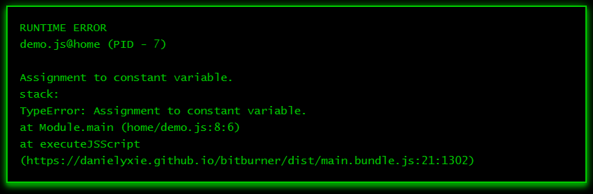

# Decision, decision

This section is about making decisions. You will learn various JavaScript
statements that allow your programs to make simple decisions. Chain the
statements together to allow your programs to execute code along various paths,
depending on the choices you make. For the case where you need to run a bunch of
code over and over again, JavaScript has various statements that can be used to
loop over the code until a condition is met.

## I can't decide

How many times do you find yourself unable to make up your mind about something?
JavaScript provides various ways to help you construct a program that branches
into several paths, depending on whichever choice you make. The techniques are
not guaranteed to cure you of indecision, but at least make it seem like your
program knows when to be resolute.

### `if` statement

Sam is writing a program to manage the meal schedule of Tabby. Every Friday, Sam
usually feeds Tabby a slice of salmon. How would Sam code the latter logic into
the program? Sam reasons as follows: If today is Friday, then give Tabby a slice
of salmon. JavaScript has the `if` statement to allow you to implement simple
reasoning in your programs. The `if` statement has the following structure:

```js
if (condition) {
    // Insert code here in case the condition is true.
}
```

Here, `condition` should be JavaScript code that evaluates to a boolean. You
often find the condition to be an expression that compares one thing with
another thing. If the condition evaluates to `true`, then you should insert code
at the specified region to handle the true case. This region is the `if` block.
The `if` block starts from the open brace `{` and ends at the closing brace `}`.
In the context of Sam's program, the condition is code that compares the current
day with the string `"Friday"`. Sam uses the following code in an early version
of the meal schedule program:

```js
/**
 * salmon-v1.js
 *
 * Salmon day for Tabby.
 *
 * @param ns The Netscript API.
 */
export async function main(ns) {
    const today = "Friday";
    const salmonDay = "Friday";
    if (today === salmonDay) {
        ns.tprintf("Today is Tabby's salmon day.");
    }
}
```

In the script `salmon-v1.js`, the condition is the expression
`today === salmonDay`, which compares two strings. If the comparison returns
`true`, then the script enters the `if` block and output the string
`"Today is Tabby's salmon day."` to the terminal.

### `if...else` statement

Let's extend the `if` statement to handle the case where the condition evaluates
to `false`. Doing so would allow Sam to write a more robust program than the
script `salmon-v1.js`. JavaScript has the `if...else` statement to allow Sam to
write code for the `if` (true) block as well as code for the `else` (false)
block. The statement follows this structure:

```js
if (condition) {
    // Insert code in case condition is true.
} else {
    // Insert code in case condition is false.
}
```

The `if...else` statement extends the `if` statement to include an `else` block.
The `else` block starts at `else {` and ends at `}`. In case the condition
evaluates to `false`, code within the `else` block would be executed. Sam now
uses the `if...else` statement to extend the meal scheduler as follows:

```js
/**
 * salmon-v2.js
 *
 * Salmon day for Tabby.
 *
 * @param ns The Netscript API.
 */
export async function main(ns) {
    const today = "Thursday";
    const tomorrow = "Friday";
    const salmonDay = "Friday";

    if (today === salmonDay) {
        ns.tprintf("Today is Tabby's salmon day.");
    } else {
        ns.tprintf("No salmon for Tabby today.");
    }

    if (tomorrow === salmonDay) {
        ns.tprintf("Tomorrow will be Tabby's salmon day.");
    } else {
        ns.tprintf("No salmon for Tabby tomorrow.");
    }
}
```

The condition in the `if` statement, and the `if...else` statement, must be an
expression that evaluates to a boolean. The condition can be a chain of boolean
expressions, connected by the operators `||` and/or `&&`. For instance, many
countries have Saturday and Sunday as their weekend. Given a particular day of
the week, the script below chains boolean expressions together as part of a
condition.

```js
/**
 * Chain multiple boolean expressions.
 *
 * @param ns The Netscript API.
 */
export async function main(ns) {
    const today = "Saturday";
    if (today === "Saturday" || today === "Sunday") {
        ns.tprintf(`It's the weekend.`);
    } else {
        ns.tprintf(`Not the weekend, yet.`);
    }
}
```

### Exercises

> **Exercise 1.** Run the scripts `salmon-v1.js` and `salmon-v2.js` to see what
> would be printed to the terminal.
>
> **Exercise 2.** Read more about the `if...else` statement
> [here](https://developer.mozilla.org/en-US/docs/Web/JavaScript/Reference/Statements/if...else).
>
> **Exercise 3.** On Thursday, Tabby likes to eat a small bite of cheese. Modify
> the script `salmon-v2.js` so the first `if...else` statement notifies Sam
> about whether today is Tabby's cheese day.
>
> **Exercise 4.** Noon starts from 12 pm. The JavaScript code

```js
const currentHour = new Date().getHours();
```

> gives you the current hour in 24-hour format. If it is currently 8 am, then
> the result would be the number `8`. If it is 1 pm, the result would be `13`.
> Write a program to get the current hour. If it is currently 12 pm, then output
> the string `"It's high noon."` to the terminal. Otherwise print the string
> `"Not yet high noon."` for all other hours.
>
> **Exercise 5.** An integer $n$ is even provided it can be divided by 2,
> otherwise $n$ is odd. An exercise from the subsection
> [Smooth operator](data.md#smooth-operator) describes a technique to generate
> "random" integers at most 100. Write a program that uses the technique and
> decides whether the generated integer is even or odd.
>
> **Exercise 6.** According to
> [this site](https://web.archive.org/web/20230102115754/https://be.chewy.com/nutrition-food-treats-15-human-foods-that-are-safe-for-cats/)
> it is safe to feed apple, blueberry, cantaloupe, pea, pumpkin, and spinach to
> cats. Sam wants to make Monday and Wednesday as fruit days, wherein Tabby
> would be fed one of the above fruits. Tuesday and Saturday are vegetable days;
> Tabby would be fed one of the above vegetables. Given the code lines

```js
const a = "Monday";
const b = "Saturday";
```

> write a program to determine whether `a` is Tabby's fruit day, and whether `b`
> is Tabby's vegetable day. In case it is Tabby's fruit day, print the choice of
> fruits to the terminal; similarly for the vegetable day.
>
> **Exercise 7.** A four-digit year $n$ is a leap year, provided the following
> conditions are satisfied:
>
> 1. The number $n$ can be divided by 4.
> 1. The number $n$ cannot be divided by 100 or $n$ can be divided by 400. Here,
>    "or" is not exclusive or.
>
> Using the following code

```js
const year = new Date().getFullYear();
```

> to obtain the current four-digit year, write a program to determine whether
> the current year is a leap year.

## So many choices

You want to make more decisions? Is that a "yes", no? JavaScript provides three
more ways for your program to make decisions, each of which is suitable for
various specific situations. See whether you can use the JavaScript statements
presented in this subsection to simplify or make your code more readable.

### Ternary operator

Sometimes you find yourself writing short `if...else` statements such as the
following:

```js
/**
 * caturday.js
 *
 * Is it Caturday yet?
 *
 * @param ns The Netscript API.
 */
export async function main(ns) {
    const today = "Saturday";
    if (today === "Saturday") {
        ns.tprintf("It's Caturday.");
    } else {
        ns.tprintf("Not Caturday.");
    }
}
```

JavaScript provides the
[_ternary operator_](https://developer.mozilla.org/en-US/docs/Web/JavaScript/Reference/Operators/Conditional_Operator)
to help you simplify your short `if...else` statements. The ternary operator is
structured as follows:

```js
condition ? codeIfTrue : codeIfFalse;
```

The `condition` should be an expression that evaluates to either `true` or
`false`. If `condition` evaluates to `true`, then whatever code is in
`codeIfTrue` would be executed. Otherwise, code in `codeIfFalse` would run. For
example, you can replace the code snippet:

```js
if ("a" === "a") {
    ns.tprintf("A");
} else {
    ns.tprintf("Not A.");
}
```

with the one-liner:

```js
"a" === "a" ? ns.tprintf("A") : ns.tprintf("Not A.");
```

The result of the ternary operator can be saved for later use. All you need to
do is ensure each of `codeIfTrue` and `codeIfFalse` returns some kind of value.
As another example, you can simplify the above `if...else` statement as

```js
const result = "a" === "a" ? "A" : "Not A.";
ns.tprintf(result);
```

Should you be using the ternary operator instead of an `if...else` statement?
Maybe yes, maybe no. Ask yourself this question: If I replace an `if...else`
statement with a ternary operator, would the resulting code be readable to me
and/or other people? Readability is important in computer programming. You write
code not only for a computer to run, but also for other humans to read as well.
Prioritize readability as much as possible, unless you have a reason to the
contrary.

### `if...else if...else`

According to
[this page](https://web.archive.org/web/20230103034111/https://www.petplace.com/article/cats/pet-health/average-life-expectancy-cats/),
a kitten is a cat from birth to six months in human time. From seven months to
two years, a cat is known as a junior. The next stage is prime, i.e. between
three and six years. The cat enters the mature stage starting from seven years
and ends at 10 years.

Sam wants to translate the above description into JavaScript code. Fortunately,
JavaScript allows the `if` and `if...else` statements to be chained to help us
code complex decisions into our programs. The chaining takes the following
structure:

```js
if (condition1) {
    // Insert code if condition1 is true.
} else if (condition2) {
    // Insert code if condition2 is true.
} else if (condition3) {
    // Insert code if condition3 is true.
} else {
    // Insert code if all the above conditions are false.
}
```

You can have as many `else if` blocks as you want. Sam uses the above structure
to write a program about the lifespan of Tabby:

```js
/**
 * lifespan.js
 *
 * Tabby's lifespan.
 *
 * @param ns The Netscript API.
 */
export async function main(ns) {
    const age = 2;
    const name = "Tabby";
    if (0 <= age && age <= 0.5) {
        ns.tprintf(`${name} is a kitten.`);
    } else if (0.5 < age && age <= 2) {
        ns.tprintf(`${name} is a junior.`);
    } else if (2 < age && age <= 6) {
        ns.tprintf(`${name} is in the prime stage.`);
    } else if (6 < age && age <= 10) {
        ns.tprintf(`${name} is a mature.`);
    } else {
        ns.tprintf("More than a decade with Sam.");
    }
}
```

### `switch`

In the previous subsection, Sam chained together a bunch of `if` and `if...else`
statements to categorize Tabby into one of several life stages. Let's consider
the reverse situation. Suppose the life stage of Tabby is known. How would Sam
determine the age range (in human years) of Tabby?

By using the
[`switch`](https://developer.mozilla.org/en-US/docs/Web/JavaScript/Reference/Statements/switch)
statement, of course. One version of the `switch` statement has the following
structure:

```js
switch (expression) {
    case value1:
        // Insert code here if
        // expression evaluates to value1.
        break;
    case value2:
        // Insert code here if
        // expression evaluates to value2.
        break;
    ...
    case valueN:
        // Insert code here if
        // expression evaluates to valueN.
        break;
    default:
        // Insert code here if expression does not
        // evaluate to any of the above values.
}
```

The `expression` should be valid JavaScript code that evaluates to a value. Each
of `value1`, `value2`, and so on should be one among several possible values of
`expression`. The
[`break`](https://developer.mozilla.org/en-US/docs/Web/JavaScript/Reference/Statements/break)
statement terminates the whole `switch` statement, i.e. it breaks out of the
`switch` block. The `default` block near the end of the `switch` statement is a
fail-safe for you to handle the situation where `expression` does not evaluate
to any of the given values. If `expression` does not evaluate to any of the
expected cases, insert code within the `default` block for the, umm..., default
result of the `switch` statement. The `default` block plays a similar role to
the `else` block of an `if...else` statement.

Sam uses the `switch` statement to map from Tabby's life stage to the
corresponding age range as follows:

```js
/**
 * stage-to-age.js
 *
 * Tabby's lifespan.
 * Life stage to age range.
 *
 * @param ns The Netscript API.
 */
export async function main(ns) {
    const stage = "junior";
    let ageRange = "";
    switch (stage) {
        case "kitten":
            ageRange = "birth to 6 months";
            break;
        case "junior":
            ageRange = "7 months to 2 years";
            break;
        case "prime":
            ageRange = "3 to 6 years";
            break;
        case "mature":
            ageRange = "7 to 10 years";
            break;
        default:
            ageRange = "over 10 years";
    }
    ns.tprintf(`Tabby's age range: ${ageRange}`);
}
```

### Exercises

> **Exercise 1.** Read more about the ternary operator
> [here](https://developer.mozilla.org/en-US/docs/Web/JavaScript/Reference/Operators/Conditional_Operator).
>
> **Exercise 2.** What is readable code? Find out more
> [here](https://web.archive.org/web/20230103071743/https://code.tutsplus.com/tutorials/top-15-best-practices-for-writing-super-readable-code--net-8118).
>
> **Exercise 3.** Use the ternary operator to simplify the `caturday.js` script.
>
> **Exercise 4.** Use the ternary operator to simplify the following program.

```js
/**
 * Odd or even?
 *
 * @param ns The Netscript API.
 */
export async function main(ns) {
    const n = 8;
    let parity = "";
    if (n % 2 === 0) {
        parity = "even";
    } else {
        parity = "odd";
    }
    ns.tprintf(parity);
}
```

> **Exercise 5.** From 11 to 14 human years, a cat is in its senior stage. The
> final stage of a cat's lifespan is from 15 years onward, also referred to as
> the geriatric stage. Extend the scripts `lifespan.js` and `stage-to-age.js` to
> include the above two stages of Tabby's lifespan.
>
> **Exercise 6.** Read more about the `switch` statement
> [here](https://developer.mozilla.org/en-US/docs/Web/JavaScript/Reference/Statements/switch).
>
> **Exercise 7.** According to
> [this site](https://web.archive.org/web/20230102072021/https://www.vet.cornell.edu/departments-centers-and-institutes/cornell-feline-health-center/health-information/feline-health-topics/how-often-should-you-feed-your-cat),
> the number of times a cat should be fed each day can depend on its age. A
> kitten from birth up to six months old (human time) requires three meals per
> day. From six months to one year, a cat matures to adulthood and should be fed
> two times a day. From one year onward, it is OK to feed a cat once a day as
> long as the cat is healthy. Tabby is currently 2 years old in human time.
> Translate the above description into JavaScript code to help Sam decide how
> many times per day to feed Tabby.
>
> **Exercise 8.** The JavaScript code

```js
const d = new Date().getDay();
```

> gives you an integer between 0 and 6, inclusive, that represents the current
> day of the week. The number 0 means Sunday, 1 corresponds to Monday, 2
> represents Tuesday, etc. Write a program to convert the result of the above
> line of code into the corresponding day of the week.

## Can you repeat that?

We now discuss what a computer does best: repeat something over and over again.
The looping mechanism, or ability to repeat, allows a computer to perform
mindless tasks time and again that would otherwise render you bored to tears.
Let me repeat again: repetition is good.

### `for`

One of the looping mechanisms most programming languages provide is the `for`
statement, otherwise known as the `for` loop. In JavaScript, the `for` statement
is structured as follows:

```js
for (initialization; condition; update) {
    // Loop body. Code here would be repeated over and over.
}
```

The `initialization` is an expression that is evaluated before the loop begins.
You often want the `initialization` to declare a variable whose sole purpose is
to be the loop counter. The `condition` is an expression that is evaluated prior
to each iteration of the loop. The `condition` should evaluate to a boolean. If
the `condition` evaluates to `true`, then code within the loop body would be
executed. In case the `condition` evaluates to `false`, the loop ends and
execution picks up from the first code statement following the closing brace `}`
of the `for` statement. Finally, the `update` is an expression that is evaluated
at the end of each iteration of the loop. The `update` typically increments (or
decrements) the loop counter.

Let's use a simple example to help us understand the above description of the
`for` loop. Consider the following program to output the integers from 0 to 9 to
the terminal.

```js
/**
 * for-int.js
 *
 * Print 10 integers to the terminal.
 *
 * @param ns The Netscript API.
 */
export async function main(ns) {
    const max = 10;
    for (let i = 0; i < max; i++) {
        ns.tprintf(`${i}`);
    }
    ns.tprintf(`Printed ${max} integers.`);
}
```

The initialization is the expression `let i = 0`. The condition is the
expression `i < max`, where the variable `max` has been declared to hold the
integer `10`. Finally, the update is the expression `i++`. Prior to entering the
first iteration of the loop, the condition `i < max` is evaluated to determine
whether it results in a `true` value. The value of `i` is initially `0`, hence
the expression `i < max` evaluates to `true`. We now enter the loop body for the
first time and the code inside the loop body prints the value of `i` to the
terminal. We have executed all code we can within the loop body, so we now
evaluate the update expression `i++`. The expression increments `i` by 1 and `i`
now takes on the value 1. Control then jumps to the condition again, where we
evaluate the expression `i < max`. Again the expression evaluates to `true`
because 1 is indeed less than 10. We enter the loop body for the second time,
print the integer `1` to the terminal, and the update expression increments the
variable `i` to 2. Control jumps to the condition and we repeat the above
process. The loop ends when `i < max` evaluates to `false`, which occurs when
`i` holds the value 10. The last value of `i` printed to the terminal is
therefore 9.

Let's make the above program more interesting. Let's modify the program to sum
all integers from 0 to 9, inclusive. You need a variable to keep track of the
cumulative sum. Declare such a variable outside of, and before, the loop. No
need to modify the initialization, condition, and update portions of the loop.
Each time you enter the loop body, you add the value of `i` to the cumulative
sum. The program below should do what we wanted.

```js
/**
 * sum9.js
 *
 * Sum of integers from 0 to 9, inclusive.
 *
 * @param ns The Netscript API.
 */
export async function main(ns) {
    const max = 10;
    let sum = 0;
    for (let i = 0; i < max; i++) {
        sum += i;
    }
    ns.tprintf(`Sum is ${sum}`);
}
```

### `let` and `const`

In the latter program, why did we declare `max` as `const max` and `sum` as
`let sum`? Why not `const max` and `const sum`? Or `let max` and `let sum`? When
you use the keyword `const` to declare a variable and immediately assign a value
to the variable, JavaScript prohibits you from reassigning the `const` variable.
It does not matter if you reassign the same (or a different) value to the
`const` variable. Think of `const` as constant. A constant does not change its
value. Thus `max` is a constant. (Does that mean `max` is a constant variable?
Sounds like an oxymoron does it not?)

Being the inquisitive learner that you are, you modify the program as follows:

```js
/**
 * Sum of integers from 0 to 9, inclusive.
 *
 * @param ns The Netscript API.
 */
export async function main(ns) {
    const max = 10;
    max = 11; // <-- Error here.
    let sum = 0;
    for (let i = 0; i < max; i++) {
        sum += i;
    }
    ns.tprintf(`Sum is ${sum}`);
}
```

You execute the modified script. Then Bitburner (and ultimately JavaScript)
yells something like this at you:

> Hey, didn't you give `max` the value `10` and told me that you don't want to
> change the value of `max`? Why are you giving `max` a different value now?
> Can't you make up your mind? That's it. I quit.

That is not really far from the truth. JavaScript does not like the modified
program, gives you the cryptic message shown in the image below, and stops
running the rest of your script. A variable declared using `const` should stick
to one and only one value.



Let's talk about `let`. A variable declared with the keyword `let` can have its
value changed. That is it, really. Short and sweet.

### `while`

While we are on the topic of looping, let's consider another means of repeating
things in JavaScript. The `while` statement is structured as follows:

```js
while (condition) {
    // Loop body. Insert code to be run again and again.
}
```

The loop body is delimited by the open brace `{` and closing brace `}`. The
`condition` should be an expression that evaluates to a boolean. First, the
`condition` is run. If the `condition` evaluates to `true`, then code within the
loop body would run. If the `condition` evaluates to `false`, execution would
jump to the code after the closing brace. After running code within the loop
body, the `condition` would be evaluated again. If the `condition` evaluates to
`true`, the above process would be repeated. Otherwise the loop ends.

The `for` and `while` loops are similar to each other, so similar in fact that
you can convert code written using one loop statement to code that uses the
other loop statement. By way of example, consider the script `for-int.js` above.
The `for` loop of the script can be written using a `while` loop like so:

```js
/**
 * A while loop equivalent of for-int.js.
 *
 * Print 10 integers to the terminal.
 *
 * @param ns The Netscript API.
 */
export async function main(ns) {
    const max = 10;
    let i = 0;
    while (i < max) {
        ns.tprintf(`${i}`);
        i++;
    }
    ns.tprintf(`Printed ${max} integers.`);
}
```

### String along some characters

Let's use the `while` statement to process strings. Recall that each string has
the
[`length`](https://developer.mozilla.org/en-US/docs/Web/JavaScript/Reference/Global_Objects/String/length)
property, which counts the number of characters in the string. Each character in
a string is associated with an index, an integer starting from 0. The next
character has an index that is 1 greater than the previous character. The
maximum index of any character in the string is the value of `length` minus 1.
The following illustrates the relationship between the string `"abcdef"` and the
index of each character.

```js
0 1 2 3 4 5
a b c d e f
```

The first character `a` has index 0. The next character is `b`, which has index
1, etc. The last character `f` has index 5, which is 1 less than the number of
characters in the string.

Suppose you declare a string like so `const s = "Mississippi";`. As `M` is the
first character, its index is 0 and you can access this character like so
`s[0]`. Notice the index is between the opening `[` and closing `]` square
brackets. How would you access the second character? The second character has
index 1 because indexing in JavaScript starts from 0. The second character can
therefore be accessed as `s[1]`.

How would you use the string index to count the number of times the character
`"i"` appears in the string `"Mississippi"`? You iterate over each character one
at a time. If `k` is the current index, then the character at index `k` is
`s[k]`. Compare `s[k]` with `"i"`. If the result of the comparison is `true`,
then you know that `"i"` occurs at index `k`. Otherwise `"i"` does not occur at
index `k`. Increment the index `k`, move on to the next character, and perform
the comparison. Repeat the above process until you have considered all
characters of the string. How do you know when to end the process? The maximum
index of the string is the value of `length` minus 1. Use this fact as your loop
condition. Here is a program that counts the number of times the character `"i"`
appears in the above string.

```js
/**
 * mississippi.js
 *
 * Count the number of times i appears in a string.
 *
 * @param ns The Netscript API.
 */
export async function main(ns) {
    const s = "Mississippi";
    let k = 0;
    let n = 0; // Count number of i.
    while (k < s.length) {
        if (s[k] === "i") {
            n++;
        }
        k++;
    }
    ns.tprintf(`"i" occurs ${n} times`);
}
```

### Exercises

> **Exercise 1.** Read more about the `for` and `while` loops
> [here](https://developer.mozilla.org/en-US/docs/Web/JavaScript/Reference/Statements/for)
> and
> [here](https://developer.mozilla.org/en-US/docs/Web/JavaScript/Reference/Statements/while).
>
> **Exercise 2.** JavaScript has the `do...while` statement as a third means of
> looping. In some cases you might find this looping mechanism useful if you
> need to execute some code at least once. Read more about the `do...while`
> statement
> [here](https://developer.mozilla.org/en-US/docs/Web/JavaScript/Reference/Statements/do...while).
>
> **Exercise 3.** Use a `while` loop to rewrite the script `sum9.js`.
>
> **Exercise 4.** Use a `for` loop to rewrite the script `mississippi.js`.
>
> **Exercise 5.** Use a `for` loop to write a program that sums all integers
> between 1 and 100, inclusive. Provide a `while` loop equivalent of your
> script.
>
> **Exercise 6.** Print the following pattern to the terminal.

```js
######
######
######
######
```

> Do so in three different ways. One of them must not use a loop.
>
> **Exercise 7.** Use a loop to output the following pattern to the terminal.

```js
#
##
###
####
#####
```

> **Exercise 8.** Use a loop to the print the multiplication table (from 1
> to 12) to the terminal.
>
> **Exercise 9.** The factorial of a positive integer $n$ is defined as
> $n! = 1 \times 2 \times 3 \times \cdots \times n$. Use a loop to calculate the
> factorial of 10.
>
> **Exercise 10.** Write a program to calculate the sum of all numeric digits in
> the string `"3141592653"`.

[[TOC](../README.md "Table of Contents")]
[[Previous](data.md "Data, darta, dayta")]
[[Next](function.md "Put that in a function")]

[](http://creativecommons.org/licenses/by-nc-sa/4.0/)
