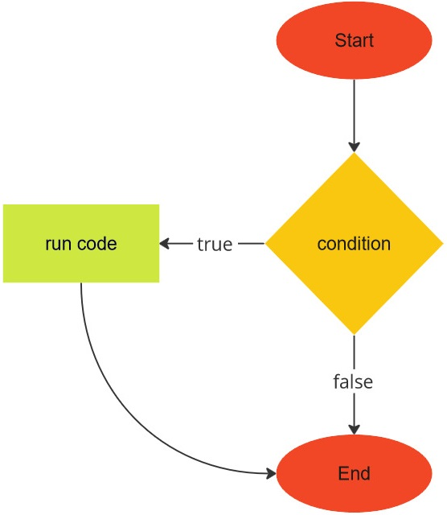
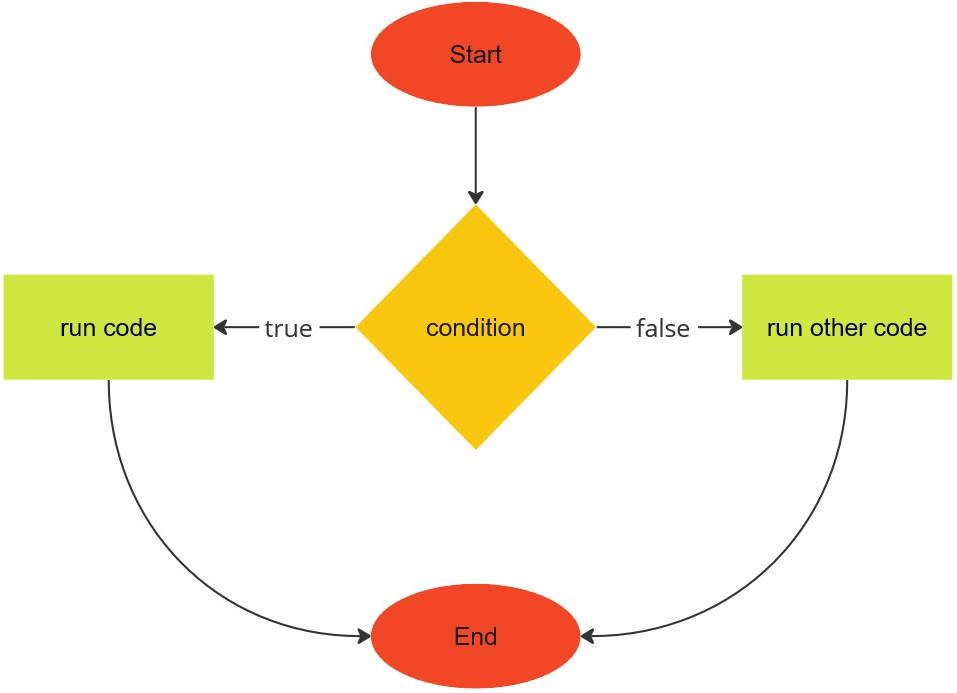

# I can't decide

How many times do you find yourself unable to make up your mind about something?
JavaScript provides various ways to help you construct a program that branches
into several paths, depending on whichever choice you make. The techniques are
not guaranteed to cure you of indecision, but at least make it seem like your
program knows when to be resolute.

<!-- ====================================================================== -->

## `if` statement

Sam is writing a program to manage the meal schedule of Tabby. Every Friday, Sam
usually feeds Tabby a slice of salmon. How would Sam code the latter logic into
the program? Sam reasons as follows: If today is Friday, then give Tabby a slice
of salmon. JavaScript has the `if` statement to allow you to implement simple
reasoning in your programs. The `if` statement has the following structure:

```js
if (condition) {
    // run code
}
```

The structure of the `if` statement is illustrated in the image below:



Here, `condition` should be JavaScript code that evaluates to a boolean. You
often find the condition to be an expression that compares one thing with
another thing. If the condition evaluates to `true`, then you should insert code
at the specified region to handle the true case. This region is the `if` block.
The `if` block starts from the open brace `{` and ends at the closing brace `}`.
In the context of Sam's program, the condition is code that compares the current
day with the string `"Friday"`. Sam uses the following code in an early version
of the meal schedule program:

```js
// salmon-v1.js

/**
 * Salmon day for Tabby.
 *
 * @param {NS} ns The Netscript API.
 */
export async function main(ns) {
    const today = "Friday";
    const salmonDay = "Friday";
    if (today === salmonDay) {
        ns.tprintf("Today is Tabby's salmon day.");
    }
}
```

In the script `salmon-v1.js`, the condition is the expression
`today === salmonDay`, which compares two strings. If the comparison returns
`true`, then the script enters the `if` block and output the string
`"Today is Tabby's salmon day."` to the terminal.

<!-- ====================================================================== -->

## `if...else` statement

Let's extend the `if` statement to handle the case where the condition evaluates
to `false`. Doing so would allow Sam to write a more robust program than the
script `salmon-v1.js`. JavaScript has the `if...else` statement to allow Sam to
write code for the `if` (true) block as well as code for the `else` (false)
block. The statement follows this structure:

```js
if (condition) {
    // run code
} else {
    // run other code
}
```

The structure of the `if...else` statement is illustrated in the image below:



The `if...else` statement extends the `if` statement to include an `else` block.
The `else` block starts at `else {` and ends at `}`. In case the condition
evaluates to `false`, code within the `else` block would be executed. Sam now
uses the `if...else` statement to extend the meal scheduler as follows:

```js
// salmon-v2.js

/**
 * Salmon day for Tabby.
 *
 * @param {NS} ns The Netscript API.
 */
export async function main(ns) {
    const today = "Thursday";
    const tomorrow = "Friday";
    const salmonDay = "Friday";

    if (today === salmonDay) {
        ns.tprintf("Today is Tabby's salmon day.");
    } else {
        ns.tprintf("No salmon for Tabby today.");
    }

    if (tomorrow === salmonDay) {
        ns.tprintf("Tomorrow will be Tabby's salmon day.");
    } else {
        ns.tprintf("No salmon for Tabby tomorrow.");
    }
}
```

The condition in the `if` statement, and the `if...else` statement, must be an
expression that evaluates to a boolean. The condition can be a chain of boolean
expressions, connected by the operators `||` and/or `&&`. For instance, many
countries have Saturday and Sunday as their weekend. Given a particular day of
the week, the script below chains boolean expressions together as part of a
condition.

```js
/**
 * Chain multiple boolean expressions.
 *
 * @param {NS} ns The Netscript API.
 */
export async function main(ns) {
    const today = "Saturday";
    if (today === "Saturday" || today === "Sunday") {
        ns.tprintf(`It's the weekend.`);
    } else {
        ns.tprintf(`Not the weekend, yet.`);
    }
}
```

<!-- ====================================================================== -->

## Exercises

> **Exercise 1.** Run the scripts `salmon-v1.js` and `salmon-v2.js` to see what
> would be printed to the terminal.
>
> **Exercise 2.** Read more about the `if...else` statement
> [here](https://developer.mozilla.org/en-US/docs/Web/JavaScript/Reference/Statements/if...else).
>
> **Exercise 3.** On Thursday, Tabby likes to eat a small bite of cheese. Modify
> the script `salmon-v2.js` so the first `if...else` statement notifies Sam
> about whether today is Tabby's cheese day.
>
> **Exercise 4.** Noon starts from 12 pm. The JavaScript code
>
> ```js
> const currentHour = new Date().getHours();
> ```
>
> gives you the current hour in 24-hour format. If it is currently 8 am, then
> the result would be the number `8`. If it is 1 pm, the result would be `13`.
> Write a program to get the current hour. If it is currently 12 pm, then output
> the string `"It's high noon."` to the terminal. Otherwise print the string
> `"Not yet high noon."` for all other hours.
>
> **Exercise 5.** An integer $n$ is even if it can be divided by 2 without any
> remainders, otherwise $n$ is odd. An exercise from the section
> [_Smooth operator_](data.md#smooth-operator) describes a technique to generate
> "random" integers at most 100. Write a program that uses the technique and
> decides whether the generated integer is even or odd.
>
> **Exercise 6.** According to
> [this site](https://web.archive.org/web/20230102115754/https://be.chewy.com/nutrition-food-treats-15-human-foods-that-are-safe-for-cats/)
> it is safe to feed apple, blueberry, cantaloupe, pea, pumpkin, and spinach to
> cats. Sam wants to make Monday and Wednesday as fruit days, wherein Tabby
> would be fed one of the above fruits. Tuesday and Saturday are vegetable days;
> Tabby would be fed one of the above vegetables. Given the code lines
>
> ```js
> const a = "Monday";
> const b = "Saturday";
> ```
>
> write a program to determine whether `a` is Tabby's fruit day, and whether `b`
> is Tabby's vegetable day. In case it is Tabby's fruit day, print the choice of
> fruits to the terminal; similarly for the vegetable day.
>
> **Exercise 7.** A four-digit year $n$ is a leap year, provided the following
> conditions are satisfied:
>
> 1. The number $n$ can be divided by 4.
> 1. The number $n$ cannot be divided by 100 or $n$ can be divided by 400. Here,
>    "or" is not exclusive or.
>
> Using the following code
>
> ```js
> const year = new Date().getFullYear();
> ```
>
> to obtain the current four-digit year, write a program to determine whether
> the current year is a leap year.
>
> **Exercise 8.** Write a program to determine whether the current year is even
> or odd.
>
> **Exercise 9.** The weekdays are Monday, Tuesday, Wednesday, Thursday, and
> Friday. The weekends consist of Saturday and Sunday. Given the line of code
>
> ```js
> const day = "Tuesday";
> ```
>
> write a program to determine whether the value of `day` is a weekday or
> weekend.
