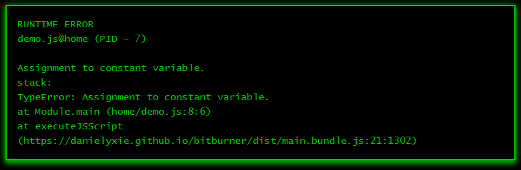
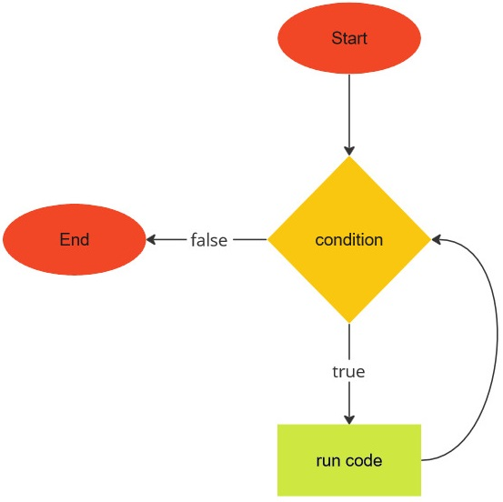

# Can you repeat that?

We now discuss what a computer does best: repeat something over and over again.
The looping mechanism, or ability to repeat, allows a computer to perform
mindless tasks time and again that would otherwise render you bored to tears.
Let me repeat again: repetition is good.

<!-- ====================================================================== -->

## `for`

One of the looping mechanisms most programming languages provide is the `for`
statement, otherwise known as the `for` loop. In JavaScript, the `for` statement
is structured as follows:

```js
for (initialization; condition; update) {
    // run code
}
```

The structure of the `for` loop is illustrated in the image below:


The `initialization` is an expression that is evaluated before the loop begins.
You often want the `initialization` to declare a variable whose sole purpose is
to be the loop counter. The `condition` is an expression that is evaluated prior
to each iteration of the loop. The `condition` should evaluate to a boolean. If
the `condition` evaluates to `true`, then code within the loop body would be
executed. In case the `condition` evaluates to `false`, the loop ends and
execution picks up from the first code statement following the closing brace `}`
of the `for` statement. Finally, the `update` is an expression that is evaluated
at the end of each iteration of the loop. The `update` typically increments (or
decrements) the loop counter.

Let's use a simple example to help us understand the above description of the
`for` loop. Consider the following program to output the integers from 0 to 9 to
the terminal.

!FILENAME for-int.js

```js
/**
 * Print 10 integers to the terminal.
 *
 * @param {NS} ns The Netscript API.
 */
export async function main(ns) {
    const max = 10;
    for (let i = 0; i < max; i++) {
        ns.tprintf(`${i}`);
    }
    ns.tprintf(`Printed ${max} integers.`);
}
```

The initialization is the expression `let i = 0`. The condition is the
expression `i < max`, where the variable `max` has been declared to hold the
integer `10`. Finally, the update is the expression `i++`. Prior to entering the
first iteration of the loop, the condition `i < max` is evaluated to determine
whether it results in a `true` value. The value of `i` is initially `0`, hence
the expression `i < max` evaluates to `true`. We now enter the loop body for the
first time and the code inside the loop body prints the value of `i` to the
terminal. We have executed all code we can within the loop body, so we now
evaluate the update expression `i++`. The expression increments `i` by 1 and `i`
now takes on the value 1. Control then jumps to the condition again, where we
evaluate the expression `i < max`. Again the expression evaluates to `true`
because 1 is indeed less than 10. We enter the loop body for the second time,
print the integer `1` to the terminal, and the update expression increments the
variable `i` to 2. Control jumps to the condition and we repeat the above
process. The loop ends when `i < max` evaluates to `false`, which occurs when
`i` holds the value 10. The last value of `i` printed to the terminal is
therefore 9.

Let's make the above program more interesting. Let's modify the program to sum
all integers from 0 to 9, inclusive. You need a variable to keep track of the
cumulative sum. Declare such a variable outside of, and before, the loop. No
need to modify the initialization, condition, and update portions of the loop.
Each time you enter the loop body, you add the value of `i` to the cumulative
sum. The program below should do what we wanted.

!FILENAME sum9.js

```js
/**
 * Sum of integers from 0 to 9, inclusive.
 *
 * @param {NS} ns The Netscript API.
 */
export async function main(ns) {
    const max = 10;
    let sum = 0;
    for (let i = 0; i < max; i++) {
        sum += i;
    }
    ns.tprintf(`Sum is ${sum}`);
}
```

<!-- ====================================================================== -->

## `let` and `const`

In the script `sum9.js`, why did we declare `max` as `const max` and `sum` as
`let sum`? Why not `const max` and `const sum`? Or `let max` and `let sum`? When
you use the keyword `const` to declare a variable and immediately assign a value
to the variable, JavaScript prohibits you from reassigning the `const` variable.
It does not matter if you reassign the same (or a different) value to the
`const` variable. Think of `const` as constant. A constant does not change its
value. Thus `max` is a constant. (Does that mean `max` is a constant variable?
Sounds like an oxymoron does it not?)

Being the inquisitive learner that you are, you modify the program as follows:

```js
/**
 * Sum of integers from 0 to 9, inclusive.
 *
 * @param {NS} ns The Netscript API.
 */
export async function main(ns) {
    const max = 10;
    max = 11; // <-- Error here.
    let sum = 0;
    for (let i = 0; i < max; i++) {
        sum += i;
    }
    ns.tprintf(`Sum is ${sum}`);
}
```

You execute the modified script. Then Bitburner (and ultimately JavaScript)
yells something like this at you:

> Hey, didn't you give `max` the value `10` and told me that you don't want to
> change the value of `max`? Why are you giving `max` a different value now?
> Can't you make up your mind? That's it. I quit.

That is not really far from the truth. JavaScript does not like the modified
program, gives you the cryptic message shown in the image below, and stops
running the rest of your script. A variable declared using `const` should stick
to one and only one value.



Let's talk about `let`. A variable declared with the keyword `let` can have its
value changed. That is it, really. Short and sweet.

<!-- ====================================================================== -->

## `while`

While we are on the topic of looping, let's consider another means of repeating
things in JavaScript. The `while` statement is structured as follows:

```js
while (condition) {
    // run code
}
```

The structure of the `while` loop is illustrated in the image below:



The loop body is delimited by the open brace `{` and closing brace `}`. The
`condition` should be an expression that evaluates to a boolean. First, the
`condition` is run. If the `condition` evaluates to `true`, then code within the
loop body would run. If the `condition` evaluates to `false`, execution would
jump to the code after the closing brace. After running code within the loop
body, the `condition` would be evaluated again. If the `condition` evaluates to
`true`, the above process would be repeated. Otherwise the loop ends.

The `for` and `while` loops are similar to each other, so similar in fact that
you can convert code written using one loop statement to code that uses the
other loop statement. By way of example, consider the script `for-int.js` above.
The `for` loop of the script can be written using a `while` loop like so:

```js
/**
 * A while loop equivalent of for-int.js.
 *
 * Print 10 integers to the terminal.
 *
 * @param {NS} ns The Netscript API.
 */
export async function main(ns) {
    const max = 10;
    let i = 0;
    while (i < max) {
        ns.tprintf(`${i}`);
        i++;
    }
    ns.tprintf(`Printed ${max} integers.`);
}
```

<!-- ====================================================================== -->

## String along some characters

Let's use the `while` statement to process strings. Recall that each string has
the
[`length`](https://developer.mozilla.org/en-US/docs/Web/JavaScript/Reference/Global_Objects/String/length)
property, which counts the number of characters in the string. Each character in
a string is associated with an index, an integer starting from 0. The next
character has an index that is 1 greater than the previous character. The
maximum index of any character in the string is the value of `length` minus 1.
The following illustrates the relationship between the string `"abcdef"` and the
index of each character.

```js
0 1 2 3 4 5
a b c d e f
```

The first character `a` has index 0. The next character is `b`, which has index
1, etc. The last character `f` has index 5, which is 1 less than the number of
characters in the string.

Suppose you declare a string like so `const s = "Mississippi";`. As `M` is the
first character, its index is 0 and you can access this character like so
`s[0]`. Notice the index is between the opening `[` and closing `]` square
brackets. How would you access the second character? The second character has
index 1 because indexing in JavaScript starts from 0. The second character can
therefore be accessed as `s[1]`.

How would you use the string index to count the number of times the character
`"i"` appears in the string `"Mississippi"`? You iterate over each character one
at a time. If `k` is the current index, then the character at index `k` is
`s[k]`. Compare `s[k]` with `"i"`. If the result of the comparison is `true`,
then you know that `"i"` occurs at index `k`. Otherwise `"i"` does not occur at
index `k`. Increment the index `k`, move on to the next character, and perform
the comparison. Repeat the above process until you have considered all
characters of the string. How do you know when to end the process? The maximum
index of the string is the value of the string property `length` minus 1. Use
this fact as your loop condition. Here is a program that counts the number of
times the character `"i"` appears in the above string.

!FILENAME mississippi.js

```js
/**
 * Count the number of times i appears in a string.
 *
 * @param {NS} ns The Netscript API.
 */
export async function main(ns) {
    const s = "Mississippi";
    let k = 0;
    let n = 0; // Count number of i.
    while (k < s.length) {
        if (s[k] === "i") {
            n++;
        }
        k++;
    }
    ns.tprintf(`"i" occurs ${n} times`);
}
```

<!-- ====================================================================== -->

## Exercises

**Exercise 1.** Read more about the `for` and `while` loops
[here](https://developer.mozilla.org/en-US/docs/Web/JavaScript/Reference/Statements/for)
and
[here](https://developer.mozilla.org/en-US/docs/Web/JavaScript/Reference/Statements/while).

**Exercise 2.** JavaScript has the `do...while` statement as a third means of
looping. In some cases you might find this looping mechanism useful if you need
to execute some code at least once. Read more about the `do...while` statement
[here](https://developer.mozilla.org/en-US/docs/Web/JavaScript/Reference/Statements/do...while).

**Exercise 3.** Use a `while` loop to rewrite the script `sum9.js`.

**Exercise 4.** Use a `for` loop to rewrite the script `mississippi.js`.

**Exercise 5.** Use a `for` loop to write a program that sums all integers
between 1 and 100, inclusive. Provide a `while` loop equivalent of your script.

**Exercise 6.** Print the following pattern to the terminal.

```
######
######
######
######
```

Do so in three different ways. One of them must not use a loop.

**Exercise 7.** Use a loop to output the following pattern to the terminal.

```
#
##
###
####
#####
```

**Exercise 8.** Use a loop to print the multiplication table (from 1 to 12) to
the terminal.

**Exercise 9.** The factorial of a positive integer $$n$$ is defined as
$$n! = 1 \times 2 \times 3 \times \cdots \times n$$. Use a loop to calculate the
factorial of 10.

**Exercise 10.** Write a program to calculate the sum of all numeric digits in
the string `"3141592653"`.
