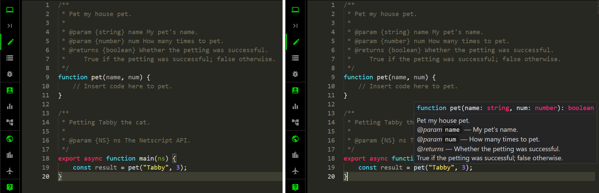

# Put that in a function

This chapter is about managing your code. You will learn various ways to help
you organize your code. Organization is important not only for readability but
also to help you discover blocks of code that can be reused in multiple scripts.

<!-- ====================================================================== -->

## I declare

A _function_ is a bunch of code associated with a name. This is not strictly
correct, but is good enough to know without being bogged down by nuance and
minutiae. You have been using functions already. Remember `ns.tprint()` and its
cousin `ns.tprintf()`? Those are functions. The name `tprint()` encapsulates one
or multiple lines of code that does whatever it needs to in order to output a
given string to the terminal. How about our constant companion `main()`
throughout the journey so far? The name `main()` encloses a bunch of code you
wrote to perform a specific task. That leads us to the topic of how to create a
function.

A function can be created by using the _declaration_ notation. You have been
using the declaration notation already without knowing it. Recall the following
template:

```js
export async function main(ns) {
    // Insert code here.
}
```

Here, the `main()` function is created via the declaration notation. You declare
`main()` to be a function by using the keyword
[`function`](https://developer.mozilla.org/en-US/docs/Web/JavaScript/Reference/Statements/function)
in front of the name. For now, ignore the keywords `export` and `async`. Use the
template below to define your own custom functions:

```js
/**
 * Explain what the function does.
 *
 * @param {typeA} paramA Explain this parameter.
 * @param {typeB} paramB Explain this other parameter.
 * ...
 * @returns {typeZ} Explain the output of the function, if any.
 */
function funcName(paramA, paramB, ...) {
    // Insert code here.
}
```

Replace `funcName` with a descriptive name for your function. Your function can
take zero, one, or more parameters. Parameters are data you give to the function
to do whatever it needs to in order to generate the result you want. The
function `ns.tprint(s)` takes one parameter `s`, which is a string, and does
whatever is required to print the string to the terminal. The function
`main(ns)` also takes one parameter, the name `ns`.

In Bitburner, `ns` is a special name because `ns` allows you to use all
functions defined in Bitburner to play the game. All functions defined by
Bitburner, and used via the name `ns`, are collectively referred to as the
_Netscript API_. Thus `ns.tprint()` is a function in Bitburner and not part of
the standard library of JavaScript functions. You have already used functions
from the standard JavaScript library, e.g.
[`Math.pow()`](https://developer.mozilla.org/en-US/docs/Web/JavaScript/Reference/Global_Objects/Math/pow)
and
[`parseInt`](https://developer.mozilla.org/en-US/docs/Web/JavaScript/Reference/Global_Objects/parseInt).
You want to get technical? Listen to Tabby whisper quietly into your ear:
`Math.pow()` is not a function, it's a _method_. The difference is technical,
but the general idea is the same. You use a name to refer to multiple lines of
code that does a specific job. Anytime you need to repeat the same task, use the
function instead of writing the same code again.

<!-- ====================================================================== -->

### Not my type

What about the text `{typeA}` or `{NS}` in the function documentation? You have
seen the snippet `{NS}` a lot in the tutorial so far without knowing why it is
there in the documentation of the function `main()`. The text `{NS}` is meant to
document the _type_ of the parameter `ns` in the function `main()`. The word
_type_ here means _data type_, the kind of data we are dealing with. The
parameter `ns` belongs to a type called `NS` specific to the game Bitburner. You
have already learnt various data types from the chapter
[_Data, darta, dayta_](data.md). Recall that _number_ is a data type, _string_
is a data type, and _boolean_ is a data type. An example should help to clarify
data types and how to document them.

Sam writes a function to pet Tabby, as shown below.

```js
/**
 * Pet my house pet.
 *
 * @param {string} name My pet's name.
 * @param {number} num How many times to pet.
 * @returns {boolean} Whether the petting was successful.
 *     True if the petting was successful; false otherwise.
 */
function pet(name, num) {
    // Insert code here to pet.
}

/**
 * Petting Tabby the cat.
 *
 * @param {NS} ns The Netscript API.
 */
export async function main(ns) {
    const result = pet("Tabby", 3);
}
```

The function `pet()` takes 2 parameters: `name` and `num`. The parameter `name`
is meant to be a string that holds the name of a pet, whereas `num` is a number
that counts how many times Sam wants to do the petting. As `name` is meant to be
a string, the documentation of the function accordingly has the segment
`@param {string} name` to tell us that the data type of `name` is string.
Similarly, the segment `@param {number} num` tells us that the data type of
`num` is number. Finally, the function is meant to return a signal indicating
whether the petting was successful. The documentation snippet
`@returns {boolean}` tells us that the function `pet()` is expected to return a
boolean. Why go to all the trouble writing up documentation for the various
parameters and return type of the function `pet()`? When you call the function,
as we do in the function `main()` above, you can hover your mouse cursor over
the function name and it would show you the documentation of the function, as
illustrated in the image below.



As shown in the image, the documentation (as revealed when you hover your mouse
cursor over the function name) can help you to correctly use the function you
are invoking.

<!-- ====================================================================== -->

### More functions

You can certainly write your own function to perform exponentiation. Given a
number $b$ called the base, you raise $b$ to another number $n$ called the
exponent. You already know that the operator `**` in JavaScript is used for
exponentiation. Your custom `pow()` function might be something like this:

```js
/**
 * Raise a number to a given power.
 *
 * @param {number} base Raise this number to a power.
 * @param {number} exponent Raise base to this power.
 * @returns {number} Raise base to the given exponent.
 */
function pow(base, exponent) {
    const result = base ** exponent;
    return result;
}

/**
 * Exponentiation.
 *
 * @param {NS} ns The Netscript API.
 */
export async function main(ns) {
    const n = pow(2, 3);
    ns.tprintf(`2 raised to the power of 3 is: ${n}`);
}
```

The keyword
[`return`](https://developer.mozilla.org/en-US/docs/Web/JavaScript/Reference/Statements/return)
is used to give a result to whatever function is calling the function `pow()`.
In the above example, it is the function `main()` that calls (or executes) the
function `pow()`. The result given by `pow()` is assigned to the variable `n`
and then a custom message is printed to the terminal.

Recall from the section [_I can't decide_](decide.md#i-cant-decide) that Friday
is Tabby's salmon day. Sam wants to create a function that accepts one
parameter, i.e. the day of the week. The function checks to see whether the
given day is Friday and, if so, returns `true` to remind Sam to feed salmon to
Tabby. Here is Sam's script:

```js
// salmon-func.js

/**
 * Is it Tabby's salmon day?
 *
 * @param {string} day Test this day.
 * @returns {boolean} True if it is Tabby's salmon day; false otherwise.
 */
function salmonDay(day) {
    if (day === "Friday") {
        return true;
    }
    return false;
}

/**
 * Salmon day for Tabby.
 *
 * @param {NS} ns The Netscript API.
 */
export async function main(ns) {
    const today = "Friday";
    const tomorrow = "Saturday";
    if (salmonDay(today)) {
        ns.tprintf("Feed Tabby a slice of salmon.");
    }
    if (!salmonDay(tomorrow)) {
        ns.tprintf("No salmon for Tabby tomorrow.");
    }
}
```

<!-- ====================================================================== -->

### Exercises

> **Exercise 1.** Use the ternary operator to shorten the function `salmonDay()`
> in the script `salmon-func.js`. Shorten the function again, but without using
> the ternary operator.
>
> **Exercise 2.** Use functions to rewrite the script `lifespan.js` from the
> section [_`if...else if...else`_](decide.md#ifelse-ifelse) and the script
> `stage-to-age.js` from the section [_`switch`_](decide.md#switch).
>
> **Exercise 3.** Write a function that returns the current day of the week.
>
> **Exercise 4.** Write a function that, given a positive integer $n$, returns
> the sum of all positive integers from 1 up to and including $n$.
>
> **Exercise 5.** Write a function that reverses the digits of an integer.
>
> **Exercise 6.** Given a temperature value in Fahrenheit, its equivalent value
> in Celsius is

```math
Celsius
=
\frac{
    Fahrenheit - 32
}{
    1.8
}
```

> Write a function to convert a temperature value from Fahrenheit to Celsius.
>
> **Exercise 7.** Use the above formula to write a function that converts a
> temperature value from Celsius to Fahrenheit.
>
> **Exercise 8.** Write a function to count the number of vowels in a string.
> Create another function to count the number of distinct vowels. Test with
> these strings: `"Mississippi"` and
> `"The quick brown fox jumps over a lazy dog."`.
>
> **Exercise 9.** Write a function that, given a positive integer $n$, returns a
> random integer between 0 and $n$, inclusive.
>
> **Exercise 10.** The
> [Fibonacci sequence](https://en.wikipedia.org/wiki/Fibonacci_sequence) is
> defined as follows. We have the initial cases of $F_0 = 0$ and $F_1 = 1$. If
> $n > 1$, then the $n$-th Fibonacci number $F_n$ is defined as

```math
F_n = F_{n-1} + F_{n-2}
```

> Write a function that, given an integer $n > 1$, returns the $n$-th Fibonacci
> number.

<!-- ====================================================================== -->

## Bow and arrow

A second way to create a function is to define it as an expression. A function
defined in this manner is called a _function expression_ and follows this
format:

```js
/**
 * Explain the purpose of the function.
 *
 * @param {typeA} paramA Explain this parameter.
 * @param {typeB} paramB Explain this other parameter.
 * @param {typeC} ... Any other parameters the function takes.
 * @returns {typeZ} Explain the return value(s) of the function, if any.
 */
const funcName = function(paramA, paramB, ...) {
    // Function body. Insert code here.
};
```

In the above template, you assign a function to a variable, namely `funcName`.
Replace `funcName` with a descriptive name that summarizes the purpose of your
function. You use `funcName` the same way as if you created it via the
declaration notation, i.e. execute like this `funcName()`.

The function expression can be shortened by using the _arrow function
expression_, which follows this pattern:

```js
/**
 * Explain the purpose of the function.
 *
 * @param {typeA} paramA Explain this parameter.
 * @param {typeB} paramB Explain this other parameter.
 * @param {typeC} ... Any other parameters the function takes.
 * @returns {typeZ} Explain the return value(s) of the function, if any.
 */
const funcName = (paramA, paramB, ...) => {
    // Function body. Insert code here.
};
```

Similar to the template for function expression, in the template for arrow
function expression you assign a function to a variable. The arrow function
expression uses the arrow notation `=>` instead of the `function` keyword. The
parameter tuple `(paramA, paramB, ...)` can have zero, one, or more parameters.
You use the empty tuple `()` if the function does not take any parameters.

Why do you need another way to create functions? Arrow function expressions are
useful when you need short, concise functions each of which does a specific task
well. Remember our `pow()` function from the section [_I declare_](#i-declare)?
We can use arrow function expression to shorten it as follows:

```js
/**
 * Exponentiation, but using arrow function expression.
 *
 * @param {NS} ns The Netscript API.
 */
export async function main(ns) {
    const pow = (a, b) => a ** b;
    const n = pow(2, 3);
    ns.tprintf(`2 raised to the power of 3 is: ${n}`);
}
```

Our `pow()` function above is a one-liner, which is why there is no need to
insert the starting brace `{` and the ending brace `}`. Furthermore, notice that
`pow()` is defined within another function, i.e. the `main()` function. Where is
the `return` statement? The `return` statement is implicit in a one-liner arrow
function expression.

Sometimes your arrow function expression requires multiple lines. That is when
you should enclose the function body within the braces `{` and `}`. Here is an
example:

```js
/**
 * Multiline arrow function expression.
 *
 * @param {NS} ns The Netscript API.
 */
export async function main(ns) {
    const printName = (name) => {
        if (name === "") {
            ns.tprintf("No name provided.");
            return;
        }
        ns.tprintf(`Your name is ${name}`);
    };
    printName("");
    printName("Sam");
}
```

Notice that you must insert an explicit `return` statement if your multiline
arrow function expression gives something back to the caller. In the above
example, if the given name is an empty string, then the function `printName()`
uses the `return` statement to exit the function. We could also have written the
function `printName()` by using the `if...else` statement, bypassing the
`return` statement altogether.

Here is another point worth discussing. How does the function `printName()` know
about `ns` when in fact we did not explicitly pass `ns` as an argument? The
short answer is _closure_. The function `printName()` is defined within
`main()`. Within the body of `main()` you can access `ns`. Any code within
`main()` therefore has access to `ns`, including the arrow function expression
`printName()`. If you place `printName()` outside the function `main()`, then
you must explicitly pass `ns` to `printName()` like so:

```js
/**
 * Print your name.
 *
 * @param {NS} ns The Netscript API.
 * @param {string} name Print this name to the terminal.
 */
const printName = (ns, name) => {
    if (name === "") {
        ns.tprintf("No name provided.");
        return;
    }
    ns.tprintf(`Your name is ${name}`);
};

/**
 * Multiline arrow function expression.
 *
 * @param {NS} ns The Netscript API.
 */
export async function main(ns) {
    printName(ns, "");
    printName(ns, "Sam");
}
```

As a final note, the function `printName()` does not return anything. Its only
purpose is to print a name provided to it. The documentation for the function
does not say anything about the return type. Whenever a function does not return
anything to the calling function (i.e. the caller), you can omit the
documentation for the return value(s).

<!-- ====================================================================== -->

### Exercises

> **Exercise 1.** Read more about function expression
> [here](https://developer.mozilla.org/en-US/docs/Web/JavaScript/Reference/Operators/function).
>
> **Exercise 2.** Read more about arrow function expression
> [here](https://developer.mozilla.org/en-US/docs/Web/JavaScript/Reference/Functions/Arrow_functions).
>
> **Exercise 3.** Use arrow function expression to simplify the script
> `salmon-func.js` from the section [_I declare_](function.md#i-declare).
>
> **Exercise 4.** Use arrow function expression to create a function that
> outputs your name to the terminal. The function takes zero arguments.
>
> **Exercise 5.** Use arrow function expression to create a function that prints
> a string as red. Write another function that prints a string as cyan.
>
> **Exercise 6.** Read more about closure
> [here](https://developer.mozilla.org/en-US/docs/Web/JavaScript/Closures).
>
> **Exercise 7.** Use arrow function expression to define a function that
> returns the maximum of two numbers. Write the corresponding arrow function
> expression for the minimum of two numbers. Try to define each function as a
> one-liner. Do not use the JavaScript methods
> [`Math.max()`](https://developer.mozilla.org/en-US/docs/Web/JavaScript/Reference/Global_Objects/Math/max)
> and
> [`Math.min()`](https://developer.mozilla.org/en-US/docs/Web/JavaScript/Reference/Global_Objects/Math/min).
>
> **Exercise 8.** Use arrow function expression to define a one-liner function
> that returns the square root of a number. Do not use the standard JavaScript
> method
> [`Math.sqrt()`](https://developer.mozilla.org/en-US/docs/Web/JavaScript/Reference/Global_Objects/Math/sqrt),
> but you can test your implementation against the said method.
>
> **Exercise 9.** The
> [Hofstadter Q sequence](https://en.wikipedia.org/wiki/Hofstadter_sequence) has
> the initial values of $Q(1) = 1$ and $Q(2) = 1$. Given an integer $n > 2$,
> then $Q(n)$ is defined as

```math
Q(n)
=
Q\big( n - Q(n - 1) \big)
+
Q\big( n - Q(n - 2) \big)
```

> Implement $Q(n)$ for $n \geq 1$. Test your implementation using various small
> values of $n$, e.g. at most 20.

<!-- ====================================================================== -->

## First-class function

Functions in JavaScript are
[_first-class functions_](https://developer.mozilla.org/en-US/docs/Glossary/First-class_Function).
This means that JavaScript allows you to do the following with functions:

<!-- prettier-ignore -->
- Assign a function to a variable.
- Pass a function as an argument to another function.
- Return a function as a value from another function.

You learnt from the section [_Bow and arrow_](function.md#bow-and-arrow) that a
function can be assigned to a variable. Simply create a function expression or
an arrow function expression. What about the other features of first-class
functions?

<!-- ====================================================================== -->

### Function as argument

How do you pass a function as an argument to another function? The same as how
you pass a variable as an argument to a function. You pass the function name, or
the variable to which you assigned the function expression, to another function.
It is the other function's job to invoke or call the passed in function. As an
example, consider the script `tabby-diet.js` below.

```js
// tabby-diet.js

/**
 * Food in Tabby's diet.
 *
 * @param {function} func A function to handle food.
 * @param {string} food A particular food.
 */
function diet(func, food) {
    func(food); // Invoke `func()` with the parameter `food`.
}

/**
 * Tabby's dietary preferences.
 *
 * @param {NS} ns The Netscript API.
 */
export async function main(ns) {
    // Functions to output food preferences.
    const fav = (food) => ns.tprintf(`Favourite food is ${food}`);
    const like = (food) => ns.tprintf(`Likes ${food}`);
    const hate = (food) => ns.tprintf(`Hates ${food}`);

    // Tabby's diet.
    diet(fav, "tuna"); // same as fav("tuna");
    diet(like, "cheese"); // same as like("cheese");
    diet(hate, "lemon"); // hate("lemon");
}
```

The function `main()` declares various arrow function expressions and assigns
each of them to a variable. We also declare a function called `diet()`, outside
of the function `main()`. The function `diet()` takes 2 parameters. The
parameter `func` should be a function name or a variable that has been assigned
a function expression. The parameter `food` would be used as a parameter of
`func` when we invoke the function. In fact, the purpose of `diet()` is to
invoke the function `func` and pass `food` as a parameter to `func`.

Here's another example. You want a function `funcA()` that takes another
function `funcB()` as a parameter. The function `funcA()` takes one or multiple
other parameters that are to be passed to `funcB()`. The purpose of `funcA()` is
to loop over the given parameters, except for the parameter `funcB`, and pass
each parameter to `funcB()`. The job of `funcB()` is to test the parameter given
to it, returning `true` if the test passes and `false` otherwise. As a concrete
example, consider the following program.

```js
/**
 * Whether a character is a punctuation character.
 *
 * @param {string} s A character.
 * @returns {boolean} True if the given character is a punctuation charcter;
 *     false otherwise.
 */
function isPunctuation(s) {
    switch (s) {
        case ".":
        case "?":
        case "!":
        case ",":
        case ";":
        case ":":
        case "-":
        case "'":
            return true;
        default:
            return false;
    }
}

/**
 * Whether a character is a vowel.
 *
 * @param {string} s A character of the English alphabet.
 * @returns {boolean} True if the given character is a vowel;
 *     false otherwise.
 */
function isVowel(s) {
    const vowel = "aeiou";
    const sc = s.toLowerCase();
    return vowel.includes(sc);
}

/**
 * Keep all characters that pass a particular test.
 *
 * @param {function} func A test function.  The function should return
 *     true if the test passes and false otherwise.
 * @param {string} str Test each character of this string.
 * @returns {string} All characters of the given string that pass the test.
 */
function keep(func, str) {
    let newStr = "";
    for (const s of str) {
        if (func(s)) {
            newStr = newStr.concat(s);
        }
    }
    return newStr;
}

/**
 * A function that accepts another function as parameter.
 *
 * @param {NS} ns The Netscript API.
 */
export async function main(ns) {
    const strA = "Everyday is caturday.";
    const vowel = keep(isVowel, strA);
    ns.tprintf(`Original string: ${strA}`);
    ns.tprintf(`Vowels only: ${vowel}`);
    ns.tprintf("\n");

    const strB = "Cate's cat scatters its food about. What a catastrophe!";
    const punc = keep(isPunctuation, strB);
    ns.tprintf(`Original string: ${strB}`);
    ns.tprintf(`Punctuation characters: ${punc}`);
}
```

The function `keep()` takes a function `func()` as a parameter and a string
`str`. The function `func()` takes a string of one character. The job of
`keep()` is to iterate over each character of the string `str` and pass each
character to `func()`. If `func()` returns true for a given character, then
`keep()` retains the particular character, otherwise `keep()` drops the
character. Finally, `keep()` returns all characters of `str` that passes the
test implemented in `func()`.

<!-- ====================================================================== -->

### Function as return value

To return a function from another function, simply declare a function `funcB()`
within another function `funcA()` and return `funcB()` as the output of
`funcA()`. This sounds more complicated than it should be. An example should
help to clarify how to return a function.

```js
/**
 * Multiply two numbers together.
 *
 * @param {number} a A number.
 * @returns {function} A function that multiplies each number by a.
 */
function multiply(a) {
    return function (b) {
        return a * b;
    };
}

/**
 * A function that returns another function.
 *
 * @param {NS} ns The Netscript API.
 */
export async function main(ns) {
    const double = multiply(2);
    const triple = multiply(3);

    ns.tprintf("Doubling");
    ns.tprintf(`1 -> ${double(1)}`);
    ns.tprintf(`2 -> ${double(2)}`);
    ns.tprintf(`3 -> ${double(3)}`);
    ns.tprintf("\n");

    ns.tprintf("Tripling");
    ns.tprintf(`1 -> ${triple(1)}`);
    ns.tprintf(`2 -> ${triple(2)}`);
    ns.tprintf(`3 -> ${triple(3)}`);
}
```

In the above program, the function `multiply()` returns another function that
has one parameter, i.e. `b`. The purpose of the returned function is to multiply
each value of `b` by the value of `a`. In the function `main()`, we invoke
`multiply(2)` to create a function that multiplies each number by 2, hence a
doubling function. We also invoke `multiply(3)` to obtain a function that
multiplies each number by 3, thus returning a tripling function.

The mathematics example above is too boring? Let's consider the formatting of
currencies. To format a currency, you output the currency symbol followed by the
currency value. For example, in the formatted currency `$1.61`, the currency
symbol is `$` (the symbol for US dollars) and the currency value is `1.61`. The
formatted currency `$1.61` is read as, "One dollar and 61 cents in US currency."
We can write a function to format various types of currencies. However, we can
generalize the formatting function to format other types of numbers, not just
currencies. Other kinds of numbers have a prefixed symbol. A positive number can
be written as `+5.210` and a negative number can be written as `-0.42`. The
program below declares a function to format numbers.

```js
/**
 * Format a number by prefixing it with a symbol.
 *
 * @param {string} sym Prefix a number with this symbol.
 * @returns {function} A function that formats a number.
 *     Use the given prefix in each formatted number.
 */
function format(sym) {
    return function (n) {
        return `${sym}${n.toFixed(2)}`;
    };
}

/**
 * Format a number in various ways.
 *
 * @param {NS} ns The Netscript API.
 */
export async function main(ns) {
    // Format various currencies.
    const dollar = format("$");
    const euro = format("€");
    const yen = format("¥");
    ns.tprintf("Various currencies");
    ns.tprintf(`${dollar(2.71)}`);
    ns.tprintf(`${euro(3.156)}`);
    ns.tprintf(`${yen(4.201)}`);
    ns.tprintf("\n");

    // Format positive/negative numbers.
    const negative = format("-");
    const positive = format("+");
    ns.tprintf("Various numbers");
    ns.tprintf(`${negative(6.78)}`);
    ns.tprintf(`${positive(7.107)}`);
}
```

Within the function `format()`, we declare another function (the inner function)
that takes a number as its parameter. The inner function prefixes the given
number with the symbol passed to `format()`. This allows us to format various
types of numbers, not just currencies. In the function `main()`, we use
`format()` to create various functions to format various types of currencies.
Furthermore, `format()` is also used to create functions that can format
positive and negative numbers.

<!-- ====================================================================== -->

## Import and export

As you gain more experience in JavaScript programming, you might notice that
some of your scripts share a lot of common code. Instead of duplicating code
across multiple scripts, you want a function that does a task and use this
function in multiple scripts. Essentially you want to write a function once and
use it anywhere.

Consider the script `tabby-profile.js` from an exercise in the section
[_String me along_](data.md#string-me-along), reproduced below for reference:

```js
// tabby-profile.js

/**
 * A profile of Tabby the cat.
 *
 * @param {NS} ns The Netscript API.
 */
export async function main(ns) {
    const cyan = "\u001b[36m";
    const red = "\u001b[31m";
    const reset = "\u001b[0m";
    const name = "Name: Tabby Whiskers";
    const pic = "Pic: 🐱";
    const like = `${cyan}Likes${reset}: fish`;
    const hate = "Hates: broccoli";
    ns.tprintf(`${name}\n${pic}\n${like}\n${hate}`);
}
```

The script prints Tabby's full name, a picture of Tabby, together with what
Tabby likes and dislikes. Sam wants to output the following profile to the
terminal:

```js
// sam-profile.js

/**
 * A profile of Sam.
 *
 * @param {NS} ns The Netscript API.
 */
export async function main(ns) {
    const name = "Name: Sam McPherson";
    const like = "Likes: sushi";
    const hate = "Hates: spinach";
    ns.tprintf(`${name}\n${like}\n${hate}`);
}
```

As you can see, the scripts `tabby-profile.js` and `sam-profile.js` share a lot
of common code. In each of these scripts, you can write a function that prints
the following to the terminal: full name, like, dislike. You would then have the
same or similar function in two scripts. As you do not want to duplicate code, a
better option would be to write a function that prints a profile, then use that
function in each of the above scripts.

Some questions come to mind. Where should you place the profile function? How
are you to use the profile function in multiple scripts? You write the profile
function in a separate file. Let's call this file `util.js`, whose purpose is to
serve as a repository of utility functions that are used in multiple scripts.
Create the file `util.js` in the top-most directory like all scripts you have
created so far. For now, the content of `util.js` is like this:

```js
/**
 * Print a profile to the terminal.
 *
 * @param {NS} ns The Netscript API.
 * @param {string} name A full name of someone or a pet.
 * @param {string} like The likes of someone or a pet.
 * @param {string} hate The dislikes of someone or a pet.
 */
export function profile(ns, name, like, hate) {
    const fname = `Name: ${name}`;
    const prefer = `Likes: ${like}`;
    const dislike = `Hates: ${hate}`;
    ns.tprintf(`${fname}\n${prefer}\n${dislike}`);
}
```

The keyword `export` as used above means other scripts can now use the function
`profile()`. The scripts `tabby-profile.js` and `sam-profile.js` can now be
implemented like this:

```js
// profile.js

import { profile } from "util.js";

/**
 * Output the profiles of Tabby and Sam to the terminal.
 *
 * @param {NS} ns The Netscript API.
 */
export async function main(ns) {
    profile(ns, "Tabby Whiskers", "fish", "broccoli");
    ns.tprintf("\n");
    profile(ns, "Sam McPherson", "sushi", "spinach");
}
```

The keyword `import` allows you to use functions exported by a script. You
import functions into your script like so:

```js
import { funcNameA, funcNameB, ... } from "/path/to/fileName.js";
```

The files `util.js` and `profile.js` are in the same directory, meaning that you
can replace the pattern `"/path/to/fileName.js"` with `"util.js"`. If `util.js`
is located within another directory and its absolute path is `/mydir/util.js`,
then you must replace the pattern `"/path/to/fileName.js"` with
`"/mydir/util.js"`.

[[TOC](../README.md "Table of Contents")]
[[Previous](decide.md "Decision, decision")]
[[Next](organize.md "Organize your data")]

[](http://creativecommons.org/licenses/by-nc-sa/4.0/)
