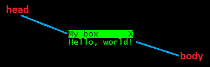

# Ooey gooey

> Wombat stew,\
> Wombat stew,\
> Gooey, brewy,\
> Yummy, chewy,\
> Wombat stew!\
> -- Marcia K. Vaughan. _Wombat Stew._ Silver Burdett Pr, 1986

<!-- ====================================================================== -->

## Dialog box

Let's begin by creating a simple dialog box. The whole interface of Bitburner is
an HTML document. You need to use a combination of CSS, HTML, and JavaScript to
create a dialog box and inject the code for that box into the HTML document of
Bitburner. By _inject_, we mean updating an HTML document on the fly. In the
case of Bitburner, we update its HTML document as the game is running. Consider
the script below to create a simple dialog box. Do not worry if you don't
understand everything in the script. We will walk through the script,
highlighting the important sections and code.

```js
/**
 * Create a simple dialog box. This function is adapted from the code at
 *
 * https://github.com/Snarling/bitburner-scripts/blob/main/simplebox/simplebox-documented.js
 *
 * by https://github.com/Snarling
 *
 * @param {string} title The title of the box.
 * @param {string} content The content of the body of the box.
 * @returns {object} The created box.
 */
function createBox(title, content) {
    // A reference to the HTML document.
    // eslint-disable-next-line
    const doc = globalThis["document"];

    // CSS styles that will be injected into the HTML document.
    const css = `.box{
        background: black;
        font: 14px "Lucida Console";
        position: fixed;
    }
    .box .head{
        background: lime;
        color: black;
        display: flex;
        justify-content: space-between;
    }
    .box .title{
    }
    .box .close{
    }
    .box .body{
        color: lime;
    }`;

    // Inject a new style element.
    doc.head.insertAdjacentHTML(
        "beforeEnd",
        `<style id=box-css>${css}</style>`
    );

    // Inject a container (our box div) into the HTML document.
    doc.body.insertAdjacentHTML(
        "beforeEnd",
        "<div class=box>" +
            "<div class=head>" +
            `<span class=title>${title}</span>` +
            "<span class=close>X</span>" +
            "</div>" +
            `<div class=body>${content}</div>` +
            "</div>"
    );

    // A reference to the box div we just added.
    const box = doc.querySelector("body>div:last-of-type");

    // Initial position of the box.
    box.style.left = "500px";
    box.style.top = "800px";

    // The closing function.  Close the box after clicking on the "X".
    box.querySelector(".close").addEventListener("click", () => box.remove());

    return box;
}

/**
 * A simple dialog box.
 *
 * @param {NS} ns The Netscript API.
 */
export async function main(ns) {
    createBox("My box", "Hello, world!");
}
```

Here's an image of the dialog box.



<!-- ====================================================================== -->

### Am I pretty?

> Queen: Magic mirror on the wall, who's the fairest one of all?\
> --- _Snow White and the Seven Dwarfs_, 1937

The first thing to note in the above script is the comment line:

```js
// eslint-disable-next-line
```

The term `eslint` refers to [ESLint](https://eslint.org/), a tool to analyze
JavaScript code and help you find bugs/problems in your code. You might also
want to use [Prettier](https://prettier.io/) to help you to automatically and
consistently format all your JavaScript files. The ESLint/Prettier combination
helps to enforce a common style for all your JavaScript code.

The above comment line tells ESLint to ignore the line of code immediately
below. We want the line

```js
const doc = globalThis["document"];
```

to be as written, without any change by ESLint itself. If we remove the comment
line `// eslint-disable-next-line`, then ESLint would transform the above line
of code to

```js
const doc = globalThis.document;
```

which is not what we want.

<!-- ====================================================================== -->

### CSS

CSS is an acronym for
[Cascading Style Sheets](https://developer.mozilla.org/en-US/docs/Web/CSS). As a
presentation language, CSS is used to style elements of an HTML document. CSS
handles styling and presentation issues such as the colour, font, and position
of an HTML element.

Consider the CSS as contained in the string:

```js
const css = `.box{
    background: black;
    font: 14px "Lucida Console";
    position: fixed;
}
.box .head{
    background: lime;
    color: black;
    display: flex;
    justify-content: space-between;
}
.box .title{
}
.box .close{
}
.box .body{
    color: lime;
}`;
```

The above CSS code defines various components that make up our dialog box. First
is the overall box itself. The box is sub-divided into various components: the
head and the body. The head is further sub-divided into the title and the button
to close the box. Here's an explanation of our box's components.

<!-- prettier-ignore -->
- The block `.box` declares the default styling of the overall box itself. By
  default, the
  [`background`](https://developer.mozilla.org/en-US/docs/Web/CSS/background)
  of the box is declared to be black. If you want a different colour for the
  background, feel free to browse the list of
  [named colours](https://developer.mozilla.org/en-US/docs/Web/CSS/named-color)
  and choose a colour you like. The text of the box has a default
  [`font`](https://developer.mozilla.org/en-US/docs/Web/CSS/font) size of 14
  pixels and using Lucida Console as the font family. Here is a list of
  [common font families](https://www.w3schools.com/csSref/css_websafe_fonts.php).
  We want the
  [`position`](https://developer.mozilla.org/en-US/docs/Web/CSS/position) of
  the box to be fixed. A benefit of having a fixed position for our box is
  that its position does not change when we scroll (either horizontally or
  vertically) through an HTML document. You can override one or more default
  styles of the box in the declaration of one or more components of the box.
  Below, we show how to override various default stylings.
- The block `.box .head` is for styling the head of the box. The head is made
  up of 2 components: the block `.box .title` for styling the title and the
  block `.box .close` for styling the button to close the box. For now, the
  styling of `.box .head` is the default styling for `.box .title` and
  `.box .close`, hence we leave the declarations of the latter 2
  sub-components empty. In the head of the box, we override the default
  [`background`](https://developer.mozilla.org/en-US/docs/Web/CSS/background)
  colour by declaring the background colour of the head to be lime. The
  foreground [`color`](https://developer.mozilla.org/en-US/docs/Web/CSS/color)
  of the text is black. The
  [`display`](https://developer.mozilla.org/en-US/docs/Web/CSS/display) of the
  head is declared as `flex`, meaning we want to use a
  [flexible layout](https://developer.mozilla.org/en-US/docs/Web/CSS/CSS_Flexible_Box_Layout)
  for the head. The property
  [`justify-content`](https://developer.mozilla.org/en-US/docs/Web/CSS/justify-content)
  is used to control the spacing of the sub-components in the head. For now,
  we use `space-between` to insert as much whitespace as possible between the
  sub-components. The head of the box has 2 sub-components. Therefore
  `justify-content: space-between;` means that the left and right
  sub-components are positioned to the left-most and right-most, respectively,
  of the head.
- The styling of the body of the box is declared in the block `.box .body`. We
  want the foreground
  [`color`](https://developer.mozilla.org/en-US/docs/Web/CSS/color) of text in
  the body to be lime.

[[TOC](../README.md "Table of Contents")]
[[Previous](fp.md "Let's get functional")] [[Next](bye.md "Wait, there's more")]
