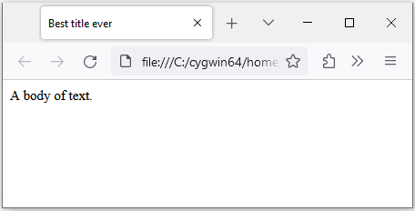

# Ooey gooey

> Wombat stew,\
> Wombat stew,\
> Gooey, brewy,\
> Yummy, chewy,\
> Wombat stew!\
> -- Marcia K. Vaughan. _Wombat Stew._ Silver Burdett Pr, 1986

In this chapter, you will learn how to create and present a graphical user
interface (GUI). While JavaScript and
[HTML](https://developer.mozilla.org/en-US/docs/Web/HTML) are used to create a
GUI, it is [CSS](https://developer.mozilla.org/en-US/docs/Web/CSS) that is
responsible for what your GUI looks like. HTML is concerned with the markup of
your GUI and CSS handles the presentation, while JavaScript is the programming
language that allows your GUI to be responsive to your input. The trio of
CSS/HTML/JavaScript will be used to walk you through the creation of a simple
dialog box.

<!-- prettier-ignore -->
- [Dialog box](gui.md#dialog-box)
- [Am I pretty?](gui.md#am-i-pretty)
- [CSS](gui.md#css)
- [HTML and JavaScript](gui.md#html-and-javascript)

<!-- ====================================================================== -->

## Dialog box

Let's begin by creating a simple dialog box. The whole interface of Bitburner is
an HTML document. You need to use a combination of CSS, HTML, and JavaScript to
create a dialog box and inject the code for that box into the HTML document of
Bitburner. By _inject_, we mean updating an HTML document on the fly. In the
case of Bitburner, we update its HTML document as the game is running. Consider
the script below to create a simple dialog box. Do not worry if you don't
understand everything in the script. We will walk through the script,
highlighting the important sections and code.

```js
// box.js

/**
 * Create a simple dialog box. This function is adapted from the code at
 *
 * https://github.com/Snarling/bitburner-scripts/blob/main/simplebox/simplebox-documented.js
 *
 * by https://github.com/Snarling
 *
 * @param {string} title The title of the box.
 * @param {string} content The content of the body of the box.
 * @returns {object} The created box.
 */
function createBox(title, content) {
    // A reference to the HTML document.
    // eslint-disable-next-line
    const doc = globalThis["document"];

    // CSS styles that will be injected into the HTML document.
    const css = `.box{
        background: black;
        font: 14px "Lucida Console";
        position: fixed;
    }
    .box .head{
        background: lime;
        color: black;
        display: flex;
        justify-content: space-between;
    }
    .box .title{
    }
    .box .close{
    }
    .box .body{
        color: lime;
    }`;

    // Inject a new style element.
    doc.head.insertAdjacentHTML(
        "beforeEnd",
        `<style id=box-css>${css}</style>`
    );

    // Inject a container (our box div) into the HTML document.
    doc.body.insertAdjacentHTML(
        "beforeEnd",
        "<div class=box>" +
            "<div class=head>" +
            `<span class=title>${title}</span>` +
            "<span class=close>X</span>" +
            "</div>" +
            `<div class=body>${content}</div>` +
            "</div>"
    );

    // A reference to the box div we just added.
    const box = doc.querySelector("body>div:last-of-type");

    // Initial position of the box.
    box.style.left = "500px";
    box.style.top = "800px";

    // The closing function.  Close the box after clicking on the "X".
    box.querySelector(".close").addEventListener("click", () => box.remove());

    return box;
}

/**
 * A simple dialog box.
 *
 * @param {NS} ns The Netscript API.
 */
export async function main(ns) {
    createBox("My box", "Hello, world!");
}
```

Here's an image of the dialog box. The components of the box are labelled as
shown in the image.


<!-- ====================================================================== -->

## Am I pretty?

> Queen: Magic mirror on the wall, who's the fairest one of all?\
> --- _Snow White and the Seven Dwarfs_, 1937

The first thing to note in the above script is the comment line:

```js
// eslint-disable-next-line
```

The term `eslint` refers to [ESLint](https://eslint.org/), a tool to analyze
JavaScript code and help you find bugs/problems in your code. You might also
want to use [Prettier](https://prettier.io/) to help you to automatically and
consistently format all your JavaScript files. The ESLint/Prettier combination
helps to enforce a common style for all your JavaScript code.

The above comment line tells ESLint to ignore the line of code immediately
below. We want the line

```js
const doc = globalThis["document"];
```

to be as written, without any change by ESLint itself. If we remove the comment
line `// eslint-disable-next-line`, then ESLint would transform the above line
of code to

```js
const doc = globalThis.document;
```

which is not what we want.

<!-- ====================================================================== -->

## CSS

CSS is an acronym for
[Cascading Style Sheets](https://developer.mozilla.org/en-US/docs/Web/CSS). As a
presentation language, CSS is used to style elements of an HTML document. CSS
handles styling and presentation issues such as the colour, font, and position
of an HTML element.

Consider the CSS as contained in the string:

```js
const css = `.box{
    background: black;
    font: 14px "Lucida Console";
    position: fixed;
}
.box .head{
    background: lime;
    color: black;
    display: flex;
    justify-content: space-between;
}
.box .title{
}
.box .close{
}
.box .body{
    color: lime;
}`;
```

The above CSS code defines various components that make up our dialog box. First
is the overall box itself. The box is sub-divided into various components: the
head and the body. The head is further sub-divided into the title and the button
to close the box. Here's an explanation of our box's components.

<!-- prettier-ignore -->
- The block `.box` declares the default styling of the overall box itself. By
  default, the
  [`background`](https://developer.mozilla.org/en-US/docs/Web/CSS/background)
  of the box is declared to be black. If you want a different colour for the
  background, feel free to browse the list of
  [named colours](https://developer.mozilla.org/en-US/docs/Web/CSS/named-color)
  and choose a colour you like. The text of the box has a default
  [`font`](https://developer.mozilla.org/en-US/docs/Web/CSS/font) size of 14
  pixels and using Lucida Console as the font family. Here is a list of
  [common font families](https://www.w3schools.com/csSref/css_websafe_fonts.php).
  We want the
  [`position`](https://developer.mozilla.org/en-US/docs/Web/CSS/position) of
  the box to be fixed. A benefit of having a fixed position for our box is
  that its position does not change when we scroll (either horizontally or
  vertically) through an HTML document. You can override one or more default
  styles of the box in the declaration of one or more components of the box.
  Below, we show how to override various default stylings.
- The block `.box .head` is for styling the head of the box. The head is made
  up of 2 components: the block `.box .title` for styling the title and the
  block `.box .close` for styling the button to close the box. For now, the
  styling of `.box .head` is the default styling for `.box .title` and
  `.box .close`, hence we leave the declarations of the latter 2
  sub-components empty. In the head of the box, we override the default
  [`background`](https://developer.mozilla.org/en-US/docs/Web/CSS/background)
  colour by declaring the background colour of the head to be lime. The
  foreground [`color`](https://developer.mozilla.org/en-US/docs/Web/CSS/color)
  of the text is black. The
  [`display`](https://developer.mozilla.org/en-US/docs/Web/CSS/display) of the
  head is declared as `flex`, meaning we want to use a
  [flexible layout](https://developer.mozilla.org/en-US/docs/Web/CSS/CSS_Flexible_Box_Layout)
  for the head. The property
  [`justify-content`](https://developer.mozilla.org/en-US/docs/Web/CSS/justify-content)
  is used to control the spacing of the sub-components in the head. For now,
  we use `space-between` to insert as much whitespace as possible between the
  sub-components. The head of the box has 2 sub-components. Therefore
  `justify-content: space-between;` means that the left and right
  sub-components are positioned to the left-most and right-most, respectively,
  of the head.
- The styling of the body of the box is declared in the block `.box .body`. We
  want the foreground
  [`color`](https://developer.mozilla.org/en-US/docs/Web/CSS/color) of text in
  the body to be lime.

<!-- ====================================================================== -->

## HTML and JavaScript

Let's now discuss the markup of our dialog box.
[HTML](https://developer.mozilla.org/en-US/docs/Learn/HTML/Introduction_to_HTML/Getting_started)
stands for HyperText Markup Language. Whereas CSS is concerned with how to
display our dialog box, HTML and JavaScript are used to tell Bitburner (and a
web browser) what to display. An HTML document usually has a
[head](https://developer.mozilla.org/en-US/docs/Web/HTML/Element/head) element
and a [body](https://developer.mozilla.org/en-US/docs/Web/HTML/Element/body)
element, as shown in the following sample HTML document:

```html
<!DOCTYPE html>
<html>
    <head>
        <title>Best title ever</title>
    </head>

    <body>
        A body of text.
    </body>
</html>
```

Here is what the HTML document looks like when rendered by a web browser (in
this case [Firefox](https://en.wikipedia.org/wiki/Firefox)):



The head of an HTML document contains metadata meant for the web browser to
process. JavaScript code and CSS can be embedded in the head section of an HTML
document. The body of an HTML document contains the content, that which is
displayed on a web browser.

Our dialog box is modelled on the head/body structure of an HTML document. The
line

```js
const doc = globalThis["document"];
```

obtains a reference to the HTML document, allowing us easy access to the
document itself. The code

```js
doc.head.insertAdjacentHTML("beforeEnd", `<style id=box-css>${css}</style>`);
```

uses the method
[`insertAdjacentHTML()`](https://developer.mozilla.org/en-US/docs/Web/API/Element/insertAdjacentHTML)
to insert our CSS code into the head of the document. The parameter
`"beforeend"` means we want to insert our CSS code just before the end of the
head element.

Now comes the markup of our dialog box. The block of code

```js
doc.body.insertAdjacentHTML(
    "beforeEnd",
    "<div class=box>" +
        "<div class=head>" +
        `<span class=title>${title}</span>` +
        "<span class=close>X</span>" +
        "</div>" +
        `<div class=body>${content}</div>` +
        "</div>"
);
```

uses the [`div`](https://developer.mozilla.org/en-US/docs/Web/HTML/Element/div)
HTML element to declare the content of our dialog box. The title of our box is
inserted in the head component of the box. We use the character `X` to indicate
a button for closing the box. The content of our box is inserted into the body
of the box. The line of code

```js
const box = doc.querySelector("body>div:last-of-type");
```

obtains a reference to the div container that defines our box. The method
[`querySelector`](https://developer.mozilla.org/en-US/docs/Web/API/Document/querySelector)
allows us to query the HTML document for a specific element and returns the
first match. The box `div` is the last to be added. The selector string
[`"body>div:last-of-type"`](https://developer.mozilla.org/en-US/docs/Web/CSS/:last-of-type)
allows us to locate the last `div` added. Having obtained a reference to our box
`div`, we use the reference to set the initial position of the box as shown in
the code

```js
box.style.left = "500px";
box.style.top = "800px";
```

The above code positions the top-left corner of the dialog box at the pixel
coordinates $(500, 800)$.

Recall that the character `X` is inserted into the head component of our box.
Its purpose is to serve as a button to close the box. As shown in the code

```js
"<span class=close>X</span>";
```

we use the CSS block

```js
.box .close{
}
```

to control how the close button is presented. For now, the closing button
inherits the default styling of the head of the box. If we click on the `X`, we
want the box to close. To achieve the latter effect, the line of code

```js
box.querySelector(".close").addEventListener("click", () => box.remove());
```

locates the component that contains the `X` and uses the method
[`addEventListener()`](https://developer.mozilla.org/en-US/docs/Web/API/EventTarget/addEventListener)
to setup a way to close the box. An
[event](https://developer.mozilla.org/en-US/docs/Learn/JavaScript/Building_blocks/Events)
is something that happens in your HTML document. The event we are interested in
is when the `X` button is clicked, hence the
[click event](https://developer.mozilla.org/en-US/docs/Web/API/Element/click_event)
as specified by the string `"click"`. The arrow function expression

```js
() => box.remove();
```

is activated when a click event is registered on the `X` button. All of the
above means that after running the script `box.js`, a dialog box is displayed
and clicking on the `X` button would close the box.

<!-- ====================================================================== -->

## Exercises

> **Exercise 1.** The
> [viewport](https://developer.mozilla.org/en-US/docs/Web/CSS/Viewport_concepts)
> is that part of a web browser that is currently displaying your HTML document.
>
> 1. The pixel coordinates $(0, 0)$ specify the top-left corner of the viewport.
>    Position the dialog box using the latter coordinates.
> 1. The dimensions of the viewport are specified by the properties
>    [`window.innerWidth`](https://developer.mozilla.org/en-US/docs/Web/API/Window/innerWidth)
>    and
>    [`window.innerHeight`](https://developer.mozilla.org/en-US/docs/Web/API/Window/innerHeight).
>    Start from 0 and increase the coordinates at which to position the dialog
>    box.
>
> **Exercise 2.** The dimensions of the dialog box, and indeed any element in an
> HTML document, can be accessed via the properties
> [`offsetWidth`](https://developer.mozilla.org/en-US/docs/Web/API/HTMLElement/offsetWidth)
> and
> [`offsetHeight`](https://developer.mozilla.org/en-US/docs/Web/API/HTMLElement/offsetHeight).
> Determine the centre of the viewport and then shift the dialog box accordingly
> so that it is positioned at the centre.
>
> **Exercise 3.** As shown in the image from the section
> [_Dialog box_](gui.md#dialog-box), the dialog box has no clear border. The
> body of the box seems like it is part of the background rather than being one
> component of the box. Use the property
> [`border`](https://developer.mozilla.org/en-US/docs/Web/CSS/border) to set a
> visible border around the dialog box.
>
> **Exercise 4.** When you hover your mouse cursor over the `X` button, you want
> the cursor to change to a style indicating that you can click on the button.
> Modify the block
>
> ```js
> .box .close{
> }
> ```
>
> by choosing a style for the property
> [`cursor`](https://developer.mozilla.org/en-US/docs/Web/CSS/cursor).
>
> **Exercise 5.** Carefully observe the image of the dialog box from the section
> [_Dialog box_](gui.md#dialog-box). Note that the text almost touches the left,
> right, top, and bottom edges of the box. You want some spacing between the
> text and the four edges of the box to contrast the text from the box itself.
> Use the [`padding`](https://developer.mozilla.org/en-US/docs/Web/CSS/padding)
> property to set a suitable padding area for all 4 sides of the box.
>
> **Exercise 6.** You want a way to use your mouse to move the dialog box around
> the viewport. Two pieces of information are required. First, you need the
> current coordinates of the box. Second, you need a way to query the
> coordinates of the mouse. The current horizontal and vertical coordinates of
> the box are specified by the properties
> [`offsetLeft`](https://developer.mozilla.org/en-US/docs/Web/API/HTMLElement/offsetLeft)
> and
> [`offsetTop`](https://developer.mozilla.org/en-US/docs/Web/API/HTMLElement/offsetTop),
> respectively. Similarly, the horizontal and vertical coordinates of the mouse
> are specified by the properties
> [`clientX`](https://developer.mozilla.org/en-US/docs/Web/API/MouseEvent/clientX)
> and
> [`clientY`](https://developer.mozilla.org/en-US/docs/Web/API/MouseEvent/clientY),
> respectively. The values of the latter properties will update as you move your
> mouse.
>
> Next, you need a way to register
> [mouse events](https://developer.mozilla.org/en-US/docs/Web/API/MouseEvent).
> Place your mouse cursor over the head component of the dialog box. Press down
> on the left mouse button and drag the box. In order for the box to actually
> move along with your mouse, you must use the method
>
> ```js
> box.querySelector(".head").addEventListener(type, listener);
> ```
>
> to register the
> [`mousedown`](https://developer.mozilla.org/en-US/docs/Web/API/Element/mousedown_event)
> event. Here, `type` should be a string that specifies the type of event of
> interest. You want to know when a mouse button is pressed. The type of event
> your script is listening for is
> [`"mousedown"`](https://developer.mozilla.org/en-US/docs/Web/API/Element/mousedown_event).
> The parameter `listener` can be a function that is invoked as soon as a mouse
> button is pressed. The listener function takes an event `e`, i.e. an object,
> as a parameter. You want this function to handle the dragging of the dialog
> box. The object `e` will have access to the mouse coordinates `clientX` and
> `clientY`. The function to handle the mouse down event would have the
> following structure:
>
> ```js
> box.querySelector(".head").addEventListener("mousedown", (e) => {
>     // Initial coordinates of box
>     // Initial coordinates of mouse
>     const mousemoveFunc = (e) => {
>         // Insert code to drag box to new location
>     };
>     const mouseupFunc = () => {
>         // Remove event listeners for mousemoveFunc() and mouseupFunc()
>     };
>     // Add event listeners for mousemoveFunc() and mouseupFunc()
> });
> ```
>
> Here's how to calculate the new coordinates of the box. Let $b_x$ and $b_y$ be
> the current horizontal and vertical coordinates, respectively, of the box. Let
> $m_x$ and $m_y$ be the current horizontal and vertical coordinates,
> respectively, of the mouse. Let $n_x$ and $n_y$ be the new horizontal and
> vertical coordinates, respectively, of the mouse. The new horizontal $x$ and
> vertical $y$ coordinates of the box are
>
> ```math
> \begin{align}
> x &= b_x + n_x - m_x \\
> y &= b_y + n_y - m_y
> \end{align}
> ```
>
> Within the mouse down listener function, declare a function `mousemoveFunc(e)`
> that takes an event object `e` and displays the dialog box at the new
> coordinates. Then use the code
>
> ```js
> doc.addEventListener("mousemove", mousemoveFunc);
> ```
>
> to register your function `mousemoveFunc(e)` with the HTML document. Your
> function `mousemoveFunc(e)` would be invoked whenever a mouse button is
> pressed. You must hold the pressed button and drag the dialog box to its new
> location.
>
> Also declare, within the mouse down listener function, a function
> `mouseupFunc()` that takes zero parameters and removes the event listeners for
> the
> [`"mousemove"`](https://developer.mozilla.org/en-US/docs/Web/API/Element/mousemove_event)
> and
> [`"mouseup"`](https://developer.mozilla.org/en-US/docs/Web/API/Element/mouseup_event)
> events. Use the method
> [`removeEventListener()`](https://developer.mozilla.org/en-US/docs/Web/API/EventTarget/removeEventListener)
> of the HTML document. You need to add the event listener for the `"mouseup"`
> event to the document, underneath where you add the event listener for the
> `"mousemove"` event.
>
> **Exercise 7.** Sam is making a lunch meal plan for the next 5 days. The
> tentative plan is as shown in the following table.
>
> | Day       | Food          | Drink      |
> | :-------- | :------------ | :--------- |
> | Monday    | sushi         | water      |
> | Tuesday   | sandwich      | juice      |
> | Wednesday | noodles       | tea        |
> | Thursday  | chicken salad | smoothie   |
> | Friday    | fish & chips  | soft drink |
>
> The HTML element pair
> [`<table></table>`](https://developer.mozilla.org/en-US/docs/Web/HTML/Element/table)
> allows you to create a table. The header of a table is defined by the element
> pair
> [`<thead></thead>`](https://developer.mozilla.org/en-US/docs/Web/HTML/Element/thead).
> Similarly, the body of a table is defined by the element pair
> [`<tbody></tbody>`](https://developer.mozilla.org/en-US/docs/Web/HTML/Element/tbody).
> A row is defined by the element pair
> [`<tr></tr>`](https://developer.mozilla.org/en-US/docs/Web/HTML/Element/tr).
> Each cell in a row is defined by the element pair
> [`<td></td>`](https://developer.mozilla.org/en-US/docs/Web/HTML/Element/td).
> Refer to
> [this page](https://developer.mozilla.org/en-US/docs/Learn/HTML/Tables/Basics)
> for an introduction to HTML tables. Convert Sam's meal plan to an HTML table
> and display the table using the dialog box. The result should be something
> like the following image.
>
> 
>
> When you hover your mouse cursor over a row of the table body, you want to
> highlight the entire row to allow for easy reading. The CSS selector
> [`:hover`](https://developer.mozilla.org/en-US/docs/Web/CSS/:hover) can be
> used to highlight an HTML element when you hover your mouse cursor over the
> element. Use the CSS structure
>
> ```js
> tr:hover {
>     // Insert style
> }
> ```
>
> to highlight a table row. Use a suitable
> [background colour](https://developer.mozilla.org/en-US/docs/Web/CSS/named-color)
> for highlighting. Refer to
> [this page](https://www.thoughtco.com/contrasting-foreground-background-colors-4061363)
> to help you choose a colour that contrasts well with the text colour.

[[TOC](../README.md "Table of Contents")]
[[Previous](fp.md "Let's get functional")] [[Next](bye.md "Wait, there's more")]
