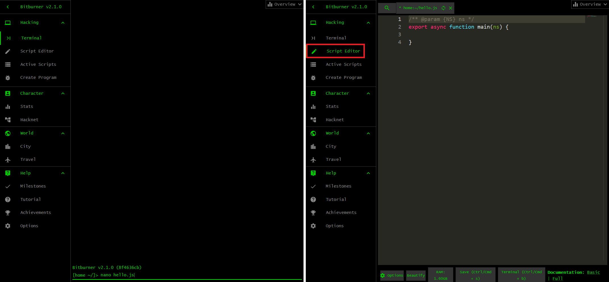
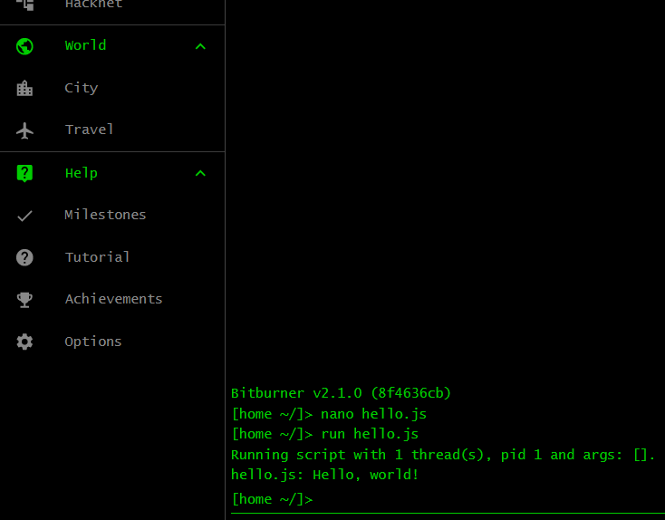

# Hello, world

## What is this?

This tutorial will help you to learn computer programming. We will use
JavaScript as the programming language and the game Bitburner as the learning
environment. Why JavaScript? Why not Python? Or C, C++, Java, Ruby, or some
other language? I find JavaScript to be reasonably easy to learn. Python is also
easy to learn. However, I have not been able to find a programming game that
encourages its players to write, say, Python or Ruby code. Let me know if you
encounter such a game for Python or Ruby or another language. The game
[ByteLegend](https://github.com/ByteLegend/ByteLegend) encourages its players to
write Java code. If you prefer Java, give ByteLegend a go.

Why Bitburner? The game encourages you to write JavaScript code, not in a
programming language specifically designed for the game. Isn't that the same
purpose as [Screeps](https://store.steampowered.com/app/464350/Screeps_World/)
and [Untrusted](https://alexnisnevich.github.io/untrusted/)? Yes. I have spent
much more time with Bitburner than I have with Screeps or Untrusted. By all
means use Screeps and/or Untrusted to learn JavaScript if you are so inclined.
Bitburner offers plenty of challenges for novice and seasoned programmers. It is
possible to write JavaScript programs that can automate the whole game for you.
Any discussion about how to play Bitburner is incidental to our main goal: use
the game to learn how to program in JavaScript.

## Bitburner

First, familiarize yourself with the Bitburner environment. Open the game in
[Steam](https://store.steampowered.com/app/1812820/Bitburner/) or use the
[online version](https://danielyxie.github.io/bitburner/). You should see
something similar to the left panel of the image below. The game places you at
the in-game tutorial. Continue with the tutorial if you want. Otherwise click
the button <kbd>SKIP TUTORIAL</kbd> and you should see something like the right
panel of the image below. This is the terminal window of the game. The terminal
window, abbreviated as terminal, is an area of the game that allows you to type
in various commands to play the game. You know you are at the terminal because
the <kbd>Terminal</kbd> tab is highlighted green. Spend some time exploring the
other tabs. When you are done, click on the <kbd>Terminal</kbd> tab to return to
the terminal. Note the `Overview` window at the top-right corner. Click on the
arrow to minimize or maximize the window.


### Exercises

> **Exercise 1.** Launch Bitburner via
> [Steam](https://store.steampowered.com/app/1812820/Bitburner/) or visit the
> [online version](https://danielyxie.github.io/bitburner/). Get to know the
> interface and what the other tabs have to offer.

## Your first program

When learning a programming language, the traditional first program you write is
called the `Hello, world` program. At the terminal, type `nano hello.js` as
shown in the left panel of the image below and press <kbd>Enter</kbd>. The
command `nano` launches an editor in which you can write your JavaScript code.
The argument `hello.js` given to `nano` tells the command to open the code
editor and create a template file named `hello.js`. The command uses the file
extension `.js` to figure out that you want to create a JavaScript program. The
code editor is shown in the right panel of the image below. If you have not done
so, explore other tabs and familiarize yourself with the game's interface. When
you are ready to code, click on the tab <kbd>Script Editor</kbd> (or press the
key combination <kbd>Alt</kbd> + <kbd>e</kbd>) to return to the code editor.



Copy and paste the following program into the code editor:

```js
/** @param {NS} ns */
export async function main(ns) {
    ns.tprint("Hello, world!");
}
```

Click on the button <kbd>Save</kbd> (or press the key combination
<kbd>Ctrl</kbd> + <kbd>s</kbd>) to save the content of the script. Click on the
<kbd>Terminal</kbd> tab (or press the key combination <kbd>Alt</kbd> +
<kbd>t</kbd>) to return to the terminal. At the terminal, type the command
`run hello.js` and press <kbd>Enter</kbd> to run your first JavaScript program.
The result is shown in the following image. You should see the text
`Hello, world!` printed to the terminal.



### Exercises

> **Exercise 1.** The terminal is the area of Bitburner that allows you to enter
> commands and run scripts. Read more about the terminal
> [here](https://bitburner-official.readthedocs.io/en/latest/basicgameplay/terminal.html).
>
> **Exercise 2.** The terminal accepts a number of commands. You have been using
> the command `run`.
> [Here](https://bitburner-official.readthedocs.io/en/latest/basicgameplay/terminal.html#run)
> are more details about the command. Do not worry if you find the information
> incomprehensible.
>
> **Exercise 3.** The terminal command `help` allows you to find out more
> information about a command. You might not always remember how to use the
> command `run`. Execute the command `help run` at the terminal to refresh your
> memory.
>
> **Exercise 4.** Browse through the
> [list of commands](https://bitburner-official.readthedocs.io/en/latest/basicgameplay/terminal.html#commands)
> to find out what the game allows you to do at the terminal.
>
> **Exercise 5.** Might I interest you in a feline companion? Why not `buy cat`
> from the comfort of your terminal?
>
> **Exercise 6.** What is that meowing you hear in the distance? Oh no, it is a
> tabby stuck in a cat flap. Feel free to `help cat` whenever you are ready.

## Any comments?

Look at the `Hello, world` program again. Notice the funny line
`/** @param {NS} ns */`? It is one of various ways that JavaScript allows you to
insert a comment in your code. You start a comment with the comment opener `/**`
and end the comment with the comment closer `*/`. When the script `hello.js`
runs, everything between `/**` and `*/` will be ignored. You could also have
written the comment of `hello.js` as follows:

```js
/**
 * Greetings.
 *
 * @param {NS} ns The Netscript API.
 */
export async function main(ns) {
    ns.tprint("Hello, world!");
}
```

What's that funny `{NS}`? Do not worry about it for now. We will discuss it
later in the tutorial, in the chapter
[_Put that in a function_](function.md#not-my-type). You can also write the
comment like this:

```js
// Greetings.
//
// @param ns The Netscript API.
export async function main(ns) {
    ns.tprint("Hello, world!");
}
```

The comment pattern `/** <comment goes here> */` is ideal for multiline
comments. Use this pattern to explain the purpose of a block of code. The
comment pattern `// <comment goes here>` is often used for a one-line comment, a
short description of a line or block of code.

If a computer is going to ignore comments, why would you bother to insert
comments in your script? The usual reason is documentation. A computer executes
your JavaScript code, but it is a human (most probably yourself) who would be
reading and trying to understand the code at some future time. You write code
not just for a computer, but for other humans as well. Imagine you are trying to
solve a programming problem. You struggle for a few hours, maybe a few days or
weeks. After a while, you find a clever solution and write up the solution as
JavaScript code. The code works and outputs the correct result. You move on to
another problem or some other challenge. Some time passed, probably a few weeks
or months. You come back to the code for the clever solution and have forgotten
how or why the code works. Reading the code gives you some hints, but you still
struggle to remember the name of the technique you used. If only you had written
at least a one-line comment to explain the technique. The situation is
contrived, absolutely. The message is clear: document your code. Even if it is a
one-line comment, use that single line to note the name of the (tricky or
clever) technique the code is implementing.

## The `main()` function

Another thing you might have noticed is that Bitburner executes your script
`hello.js` starting from the line

```js
export async function main(ns) {
```

This is the `main()` function. Don't worry yet about the segment
`export async function` or the `ns` between the parentheses. We will come back
to it later in the tutorial. For now, you should know that your code is to be
inserted at the place shown below:

```js
/**
 * Explain what the function is trying to accomplish.
 *
 * @param {NS} ns The Netscript API.
 */
export async function main(ns) {
    // Insert your code here.
}
```

The opening brace `{` delimits the start of the `main()` function. The ending
brace `}` delimits the end of the function. Your code goes between the opening
and closing braces.

### Exercises

> **Exercise 1.** You might have guessed that the function `ns.tprint()` is
> Bitburner's way of allowing you to print a message to the terminal. Let's use
> the function to output a different message to the terminal. Copy the code
> below to another script, say `intro.js`. Run the script from the terminal.
> What is printed to the terminal?

```js
/**
 * Introduce myself.
 *
 * @param {NS} ns The Netscript API.
 */
export async function main(ns) {
    ns.tprint("I'm Byte, the Bitburner bot.");
}
```

> **Exercise 2.** Edit the script `intro.js` so it would print your name when
> executed.

[[TOC](../README.md "Table of Contents")] [[Next](data.md "Data, darta, dayta")]

[](http://creativecommons.org/licenses/by-nc-sa/4.0/)
