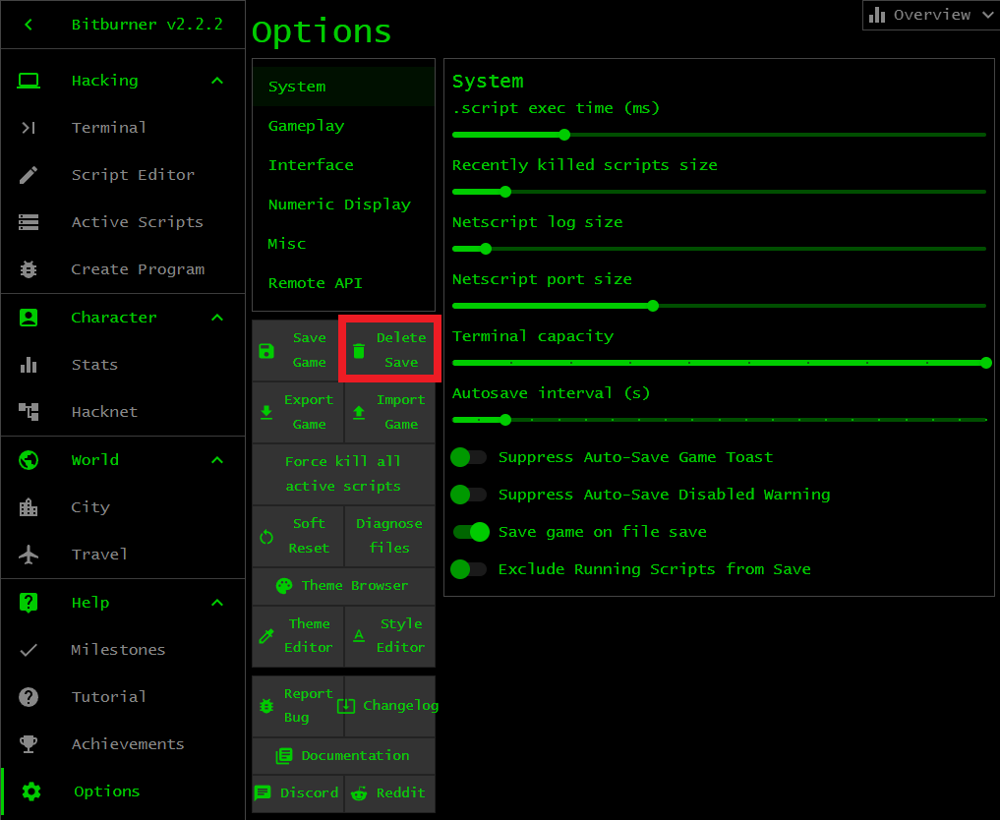

# Bitburner

Familiarize yourself with the Bitburner environment. Open the game in
[Steam](https://store.steampowered.com/app/1812820/Bitburner/) or use the
[online version](https://danielyxie.github.io/bitburner/). You should see
something similar to the left panel of the image below. The game places you at
the in-game tutorial. Continue with the tutorial if you want. Otherwise click
the button <kbd>SKIP TUTORIAL</kbd> and you should see something like the right
panel of the image below. This is the terminal window of the game. The terminal
window, abbreviated as terminal, is an area of the game that allows you to type
in various commands to play the game. You know you are at the terminal because
the <kbd>Terminal</kbd> tab is highlighted green. Spend some time exploring the
other tabs. When you are done, click on the <kbd>Terminal</kbd> tab to return to
the terminal. Note the `Overview` window at the top-right corner. Click on the
arrow to minimize or maximize the window.

<!-- ====================================================================== -->

## Exercises

> **Exercise 1.** Launch Bitburner via
> [Steam](https://store.steampowered.com/app/1812820/Bitburner/) or visit the
> [online version](https://danielyxie.github.io/bitburner/). Get to know the
> interface and what the various tabs have to offer.
>
> **Exercise 2.** The objective of this exercise is to familiarize yourself with
> the Bitburner environment. Complete the in-game tutorial. Don't worry if you
> do not understand everything in the in-game tutorial. You can restart the
> in-game tutorial by closing your web browser and load the online version of
> the game again. You might have to delete all browser cookies before loading
> the online version of the game. Alternatively, the following technique works
> for both the Steam and online versions of Bitburner. Click on the tab
> <kbd>Options</kbd> and click on the button <kbd>Delete Save</kbd> for a hard
> reset as if you start Bitburner for the very first time. Refer to the image
> below. The hard reset will delete your save file. Perform a hard reset if you
> do not care about your save file or you have a backup save file.
>
> 
>
> **Exercise 3.** The
> [online tutorial](https://bitburner-official.readthedocs.io/en/latest/guidesandtips/gettingstartedguideforbeginnerprogrammers.html)
> elaborates on the in-game tutorial. Work through the online tutorial for an
> in-depth introduction to Bitburner.
