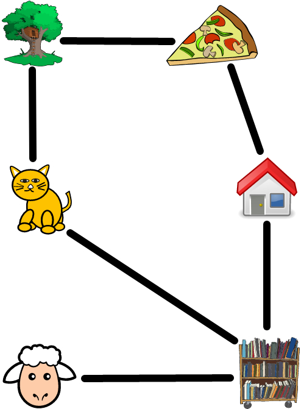

# Organize your data

The way you organize your data affects the ease and speed with which you access
the data. You should refrain from using any one technique to organize all types
of data. Each technique for organizing data is often well suited for a
particular type of data. This chapter shows you three common techniques for
organizing data. The techniques to be discussed are array, set, and map.

<!-- prettier-ignore -->
- [Line them up](organize.md#line-them-up)
- [No duplicates](organize.md#no-duplicates)
- [Check the dictionary](organize.md#check-the-dictionary)

<!-- ====================================================================== -->

## Line them up

A simple way to structure your data is to line them up one after the other. In
JavaScript, this linear structure is known as an
[_array_](https://developer.mozilla.org/en-US/docs/Web/JavaScript/Reference/Global_Objects/Array),
while other programming languages call it a _list_. Think of an array or a list
like a bunch a people waiting in single file. A better analogy for an array is
as a sequence of boxes aligned in a row. Visualize the boxes like so:

```js
+-----+-----+-----+-----+-- ... --+---------+
| a_0 | a_1 | a_2 | a_3 |   ...   | a_{n-1} |
+-----+-----+-----+-----+-- ... --+---------+
```

The boxes are read from left to right. The first box has index $0$ and the
content of the box is $a_0$, whatever that may be. The element at index $0$ is
called the front of the array. The second box has index $1$ and content $a_1$.
And so on all the way up to the last box, which has index $n-1$ and content
$a_{n-1}$. The element at index $n-1$ is called the end of the array. In total,
there are $n$ boxes and the indices of the boxes start from $0$.

<!-- ====================================================================== -->

### Array construction

How do you create an array in JavaScript? A simple way is to use square
brackets. The script below creates an array of 3 elements, each of which is a
number.

```js
// bracket-array.js

/**
 * Create an array.
 *
 * @param {NS} ns The Netscript API.
 */
export async function main(ns) {
    const array = [3, 5, 7];
    ns.tprintf(`Element at index 0: ${array[0]}`);
    ns.tprintf(`Element at index 1: ${array[1]}`);
    ns.tprintf(`Element at index 2: ${array[2]}`);
    ns.tprintf(`Element at index 3: ${array[3]}`); // undefined
    ns.tprintf(`Element at index -1: ${array[-1]}`); // undefined
}
```

As shown in the above script, you use the square bracket notation to access
individual elements in an array. For the array `array` created above, the first
element is accessed as `array[0]`, the second element is accessed as `array[1]`,
and so on. The array access `array[3]` returns
[`undefined`](https://developer.mozilla.org/en-US/docs/Web/JavaScript/Reference/Global_Objects/undefined)
because the highest index of the array is 2, not 3. Similarly, the array access
`array[-1]` returns `undefined` as well because the lowest index of the array is
0, not -1.

Array elements can also be strings or boolean values or a mixture of data types.
The script below creates arrays whose elements are of various data types.

```js
/**
 * Arrays with elements of various data types.
 *
 * @param {NS} ns The Netscript API.
 */
export async function main(ns) {
    const colour = ["red", "green", "blue"];
    const bool = [true, false];
    const mix = [2, "b", true];
    ns.tprintf(`Array of strings: ${colour}`);
    ns.tprintf(`Array of booleans: ${bool}`);
    ns.tprintf(`Array with mixed data types: ${mix}`);
}
```

<!-- ====================================================================== -->

### Array insertion

Here are some questions you might be asking about an array:

1. How do I know the number of elements in an array? Use the property
   [`length`](https://developer.mozilla.org/en-US/docs/Web/JavaScript/Reference/Global_Objects/Array/length).
1. How do I check whether an array has a given element? Use the method
   [`includes()`](https://developer.mozilla.org/en-US/docs/Web/JavaScript/Reference/Global_Objects/Array/includes).
1. How do I insert an element at the front of an array? Use the method
   [`unshift()`](https://developer.mozilla.org/en-US/docs/Web/JavaScript/Reference/Global_Objects/Array/unshift).
1. How do I insert an element at the end of an array? Use the method
   [`push()`](https://developer.mozilla.org/en-US/docs/Web/JavaScript/Reference/Global_Objects/Array/push).

The script below uses the above property/methods to query and extend an array:

```js
/**
 * Query and extend an array of numbers.
 *
 * @param {NS} ns The Netscript API.
 */
export async function main(ns) {
    // Initial array.
    const array = [3, 5, 7];
    const a = 2;
    const b = 11;
    ns.tprintf(`Array initially had ${array.length} elements.`);
    ns.tprintf(`Is ${b} in array? ${array.includes(b)}`);

    // Insert element at front of array.
    array.unshift(a);
    ns.tprintf(`Added ${a} to front of array.`);
    ns.tprintf(`Array now has ${array.length} elements.`);

    // Insert element at end of array.
    array.push(b);
    ns.tprintf(`Added ${b} to end of array.`);
    ns.tprintf(`Array now has ${array.length} elements.`);
    ns.tprintf(`Is ${b} in array? ${array.includes(b)}`);
}
```

<!-- ====================================================================== -->

### Delete front and end

Removing elements from the front or end of an array is easy. Removing an element
at an arbitrary position is a bit more involved, but not difficult. Use the
method
[`shift()`](https://developer.mozilla.org/en-US/docs/Web/JavaScript/Reference/Global_Objects/Array/shift)
to remove the first element of an array. The method returns the removed element.
Similarly, use the method
[`pop()`](https://developer.mozilla.org/en-US/docs/Web/JavaScript/Reference/Global_Objects/Array/pop)
to remove the last element of an array and return the removed element. Refer to
the following script for examples.

```js
/**
 * Remove elements from front and end of an array.
 *
 * @param {NS} ns The Netscript API.
 */
export async function main(ns) {
    const array = [2, 3, 5, 7, 11, 13];

    // Remove element from the front.
    const front = array.shift();
    ns.tprintf(`Removed ${front} from front of array.`);
    ns.tprintf(`Array now has ${array.length} elements.`);

    // Remove element from the end.
    const end = array.pop();
    ns.tprintf(`Removed ${end} from end of array.`);
    ns.tprintf(`Array now has ${array.length} elements.`);
}
```

<!-- ====================================================================== -->

### Delete arbitrary elements

What about deleting an arbitrary element from an array? Two simple ways are:

1. Delete an element at a given index. You do not know which element you want to
   delete, but you know you want to remove an element at a specific index. Use
   the method
   [`splice()`](https://developer.mozilla.org/en-US/docs/Web/JavaScript/Reference/Global_Objects/Array/splice)
   for this situation.
1. Delete a specific element. You want to remove a particular element, but you
   do not know its index. Use the method
   [`filter()`](https://developer.mozilla.org/en-US/docs/Web/JavaScript/Reference/Global_Objects/Array/filter)
   for this case.

The script below demonstrates the above two ways to delete arbitrary elements.

```js
/**
 * Remove arbitrary elements from array.
 *
 * @param {NS} ns The Netscript API.
 */
export async function main(ns) {
    let array = [2, 3, 5, 7, 11, 13];

    // Remove element at given index.
    const i = 2; // Delete element at this index.
    const a = array[i];
    const howmany = 1;
    ns.tprintf(`Current array: ${array}`);
    ns.tprintf(`Element at index ${i}: ${a}`);
    array.splice(i, howmany);
    ns.tprintf(`Array after deleting ${a}: ${array}`);

    // Remove a given element.
    const b = 7;
    const notb = (x) => x !== b;
    array = array.filter(notb);
    ns.tprintf(`Array after deleting ${b}: ${array}`);
}
```

In the above script, we used the method
[`splice()`](https://developer.mozilla.org/en-US/docs/Web/JavaScript/Reference/Global_Objects/Array/splice)
to remove an element at a specific index. We used the following version of
`splice()`:

```js
array.splice(index, deleteCount);
```

where `index` is the index of the element we want to delete. The parameter
`deleteCount` tells the method how many elements we want to remove starting from
`index` onward. We want to remove only the element at index `index`, hence we
replaced `deleteCount` with `1` as shown in the script. Unlike `shift()` and
`pop()`, the method `splice()` returns an array containing the deleted
element(s).

We used the method
[`filter()`](https://developer.mozilla.org/en-US/docs/Web/JavaScript/Reference/Global_Objects/Array/filter)
to delete an element having a specific value. The method requires a function
that returns either `true` or `false`. The usual name for such a function is
_predicate_. In the above script, our predicate is the arrow function expression
`notb`. It has one parameter and returns `true` if the passed in value is
different from the value of `b`, i.e. `7`. The method `filter()` traverses each
element of an array and passes the element to the predicate. The predicate
checks whether the given element passes a test (or tests) and return `true` or
`false` based upon the test(s). If the predicate returns `true`, then we keep
the element. Otherwise the predicate returns `false` and the element is removed.
The method `filter()` returns a copy of the array where each element passes the
test(s) of the predicate.

<!-- ====================================================================== -->

### Traversal by indices

You can use a `for` (or `while`) loop together with array indices to traverse
each element of an array. This technique requires you to create a variable to
keep track of the index of the current element. After you are done processing
the element, increment the index to process the next element. The script below
uses array index to process each element of an array.

```js
// index-walk.js

/**
 * Array traversal by indices.
 *
 * @param {NS} ns The Netscript API.
 */
export async function main(ns) {
    const colour = ["red", "orange", "yellow", "green", "blue"];
    for (let i = 0; i < colour.length; i++) {
        ns.tprintf(`Index: ${i}, colour: ${colour[i]}`);
    }
}
```

<!-- ====================================================================== -->

### Traversal by `for...of`

The
[`for...of`](https://developer.mozilla.org/en-US/docs/Web/JavaScript/Reference/Statements/for...of)
statement simplifies the process of walking over the elements of an array. This
technique is simpler than the previous insofar as it does not require you to
explicitly keep track of an index. You use the `for...of` statement as shown
below. In each iteration of the loop, the variable `elem` has the value of the
current array element.

```js
for (const elem of array) {
    // Insert code to process each element.
}
```

Using the `for...of` statement, you can simplify the script `index-walk.js` as
follows:

```js
/**
 * Array traversal by for...of statement.
 *
 * @param {NS} ns The Netscript API.
 */
export async function main(ns) {
    const colour = ["red", "orange", "yellow", "green", "blue"];
    for (const c of colour) {
        ns.tprintf(`Colour: ${c}`);
    }
}
```

You no longer need to maintain an index as the `for...of` statement does that
for you automatically.

<!-- ====================================================================== -->

### Traversal by `forEach()`

The method
[`forEach()`](https://developer.mozilla.org/en-US/docs/Web/JavaScript/Reference/Global_Objects/Array/forEach)
is more versatile than either of the above two techniques for array traversal.
You pass in a function to the method. The function should take one parameter. In
each iteration, the method `forEach()` passes the current array element to the
function, which would then process the given element. You can use the method
`forEach()` to process each array element as follows:

```js
/**
 * Array traversal by the method forEach().
 *
 * @param {NS} ns The Netscript API.
 */
export async function main(ns) {
    const colour = ["red", "orange", "yellow", "green", "blue"];
    const printColour = (c) => ns.tprintf(`Colour: ${c}`);
    const hasN = (c) => {
        const allLower = c.toLowerCase();
        if (allLower.includes("n")) {
            ns.tprintf(`Colour: ${c}`);
        }
    };
    colour.forEach(printColour);
    ns.tprintf('\nColour names that have "N".');
    colour.forEach(hasN);
}
```

<!-- ====================================================================== -->

### Exercises

> **Exercise 1.** Read more about arrays
> [here](https://developer.mozilla.org/en-US/docs/Web/JavaScript/Reference/Global_Objects/Array).
>
> **Exercise 2.** You can also create an array by using the
> [`Array()`](https://developer.mozilla.org/en-US/docs/Web/JavaScript/Reference/Global_Objects/Array/Array)
> constructor. Use the pattern

```js
const array = Array(elem0, elem1, ..., elemN);
```

> to create an array having the specified elements. The above pattern expects at
> least 2 arguments. Use the `Array()` constructor to rewrite the script
> `bracket-array.js` from the section
> [_Line them up_](organize.md#line-them-up). What happens if you provide
> exactly 1 argument to the `Array()` constructor?
>
> **Exercise 3.** The method
> [`splice()`](https://developer.mozilla.org/en-US/docs/Web/JavaScript/Reference/Global_Objects/Array/splice)
> can be used to insert a value at an arbitrary location in an array. Suppose
> you have an array `array` and you want to insert the value `v` at index `k`.
> Use the method `splice()` as follows:

```js
array.splice(k, 0, v);
```

> to insert `v` at index `k`. This effectively shifts all elements from index
> `k` onward up by 1 position, making room for `v` to be at index `k`. Use the
> method `splice()` to create the array `[2, "b", true]`.
>
> **Exercise 4.** The square bracket notation is also handy for replacing an
> element at a specified index. Suppose you have an array called `array` and you
> want to replace the element at index `k` with a new value `v`. The square
> bracket notation allows you to use the pattern

```js
array[k] = v;
```

> so that `array[k]` now has value `v`. Given the array

```js
const array = ["A", "2", "C", "D"];
```

> use the square bracket notation to replace the element `"2"` with `"B"`.
> Repeat the exercise, but this time use the method
> [`splice()`](https://developer.mozilla.org/en-US/docs/Web/JavaScript/Reference/Global_Objects/Array/splice).
>
> **Exercise 5.** You have the array `const array = ["a", "b", "c", 1, 2, 3];`.
> Use the method `splice()` to delete all numbers from the array. Repeat the
> exercise, but use the method
> [`slice()`](https://developer.mozilla.org/en-US/docs/Web/JavaScript/Reference/Global_Objects/Array/slice).
>
> **Exercise 6.** Rewrite the script `index-walk.js` from the section
> [_Traversal by indices_](#traversal-by-indices) to use a `while` loop to
> traverse the elements of an array.
>
> **Exercise 7.** You have the array `const array = [2, 4, 6, 8, 10];`. Use each
> of the following techniques to sum all elements of the array. Each technique
> should produce the same sum.
>
> 1. `for` statement.
> 1. `while` statement.
> 1. `for...of` statement.
> 1. The method `forEach()`.
>
> **Exercise 8.** Consider the array:

```js
const array = [1, 2, 1, 2, 3, 4, 5, 6, 4, 7, 8, 9, 3];
```

> Write a function to help you remove all duplicate elements from the array. You
> might find the methods
> [`slice()`](https://developer.mozilla.org/en-US/docs/Web/JavaScript/Reference/Global_Objects/Array/splice)
> and
> [`findLastIndex()`](https://developer.mozilla.org/en-US/docs/Web/JavaScript/Reference/Global_Objects/Array/findLastIndex)
> useful.
>
> **Exercise 9.** You have a small array such as

```js
const profile = ["Sam McPherson", 27, "sushi"];
```

> Instead of using indices to access each element of the array, you can use
> [_array destructuring_](https://developer.mozilla.org/en-US/docs/Web/JavaScript/Reference/Operators/Destructuring_assignment)
> to access all or some elements. You know the above array has 3 elements.
> Reading from left to right, the elements can be described as a name, an age
> value, and a food preference. You can destructure the above array and print
> the elements as follows:

```js
const [name, age, like] = profile;
ns.tprintf(`Name: ${name}\nAge: ${age}\nLike: ${like}`);
```

> Use array destructuring to access the elements of the following arrays and
> print elements to the terminal:

```js
const profile = ["Charlotte Chihuahua", 3, "milk bone"];
const fruit = ["apple", "red", "round"];
const car = ["Honda", "Civic", 2017];
```

> **Exercise 10.** You want to add each element of the array `[1, 2, 3, 4, 5]`
> to the element at the corresponding index in the array `[6, 7, 8, 9, 10]`,
> producing a new array. That is, elements at index `0` in both arrays are added
> together, elements at index `1` in both arrays are summed, and so on. Use the
> array method `forEach()` to add elements at corresponding indices in the above
> two arrays.

<!-- ====================================================================== -->

## No duplicates

JavaScript allows you to create an array that can hold duplicate elements. The
following array is perfectly OK:

```js
const array = [1, 2, 1, 2, 3];
```

In some cases, you do not want duplicate elements in your array. Instead of
searching the array to remove duplicate elements, a simpler solution is to use a
[_set_](https://developer.mozilla.org/en-US/docs/Web/JavaScript/Reference/Global_Objects/Set).
A set differs from an array in one fundamental aspect. Each element of a set
must be unique, whereas an array can have duplicate elements. A set is ideal for
organizing data that should be unique, e.g. ID numbers.

<!-- ====================================================================== -->

### Set construction

Use the
[`new Set()`](https://developer.mozilla.org/en-US/docs/Web/JavaScript/Reference/Global_Objects/Set/Set)
constructor to create a set, as per the following template:

```js
const set = new Set([elem1, elem2, ..., elemN]);
```

Pass in an array to the constructor and you should have a set whose elements are
the elements of the array. Any duplicate elements from the array would be
removed from the set. The set constructor automatically ensures the uniqueness
of each element.

The following script creates a set by using an array.

```js
// set-create.js

/**
 * Create a set.
 *
 * @param {NS} ns The Netscript API.
 */
export async function main(ns) {
    const array = [3, 3, 5, 7, 7];
    const set = new Set(array);
    const setElem = [...set]; // spread syntax
    ns.tprintf(`Original array: ${array}`);
    ns.tprintf(`Set elements: ${setElem}`);
    ns.tprintf(`How many elements? ${set.size}`);
    ns.tprintf(`Is 5 in set? ${set.has(5)}`);
}
```

Note that the array passed in to the set constructor has duplicate elements. The
set constructor automatically removes duplicate elements and creates a set whose
elements are unique. Pay special attention to the `...` notation. This is known
as the
[_spread syntax_](https://developer.mozilla.org/en-US/docs/Web/JavaScript/Reference/Operators/Spread_syntax).
The spread syntax allows you to expand (or get) all elements of a set. In the
above example, we used the spread syntax to get all elements of a set and
inserted those elements in an array. To query the number of elements a set has,
use the property
[`size`](https://developer.mozilla.org/en-US/docs/Web/JavaScript/Reference/Global_Objects/Set/size).
You use the method
[`has()`](https://developer.mozilla.org/en-US/docs/Web/JavaScript/Reference/Global_Objects/Set/has)
to query whether a set has a particular element.

<!-- ====================================================================== -->

### Set insertion

The method
[`add()`](https://developer.mozilla.org/en-US/docs/Web/JavaScript/Reference/Global_Objects/Set/add)
allows you to insert elements into a set. You might know ahead of time all or
some of the elements of a set, in which case you should collect those elements
into an array and use the set constructor to create a set having those elements.
However, it is also possible that you do not know which other elements a set
might have. The method `add()` allows you to insert new elements as you need
them. Refer to the following script for how to use the method:

```js
// set-add.js

/**
 * Insert elements into a set.
 *
 * @param {NS} ns The Netscript API.
 */
export async function main(ns) {
    const set = new Set();
    set.add("one");
    set.add(2).add("B").add(false); // Chaining the method add().
    const setElem = [...set]; // spread syntax
    ns.tprintf(`Set elements: ${setElem}`);
}
```

Note two points. First, the elements of a set can be a mixture of data types.
One element can be a string, another element a number, and a third can be a
boolean. Second, you can chain multiple calls of the method `add()`.

<!-- ====================================================================== -->

### Set deletion

You have two options:

1. Delete an individual element from a set. Use the method
   [`delete()`](https://developer.mozilla.org/en-US/docs/Web/JavaScript/Reference/Global_Objects/Set/delete).
1. Delete all elements from a set. Use the method
   [`clear()`](https://developer.mozilla.org/en-US/docs/Web/JavaScript/Reference/Global_Objects/Set/clear).

The example below uses both techniques to delete elements from a set.

```js
// set-delete.js

/**
 * Remove elements of a set.
 *
 * @param {NS} ns The Netscript API.
 */
export async function main(ns) {
    const set = new Set([2, 3, 5, 7]);
    ns.tprintf(`Original set: ${[...set]}`);
    set.delete(3);
    ns.tprintf(`After deleting 3: ${[...set]}`);
    set.clear();
    ns.tprintf(`Remove all elements, size of set is ${set.size}`);
}
```

<!-- ====================================================================== -->

### Set traversal

Like arrays, you can use the
[`for...of`](https://developer.mozilla.org/en-US/docs/Web/JavaScript/Reference/Statements/for...of)
statement and the method
[`forEach()`](https://developer.mozilla.org/en-US/docs/Web/JavaScript/Reference/Global_Objects/Set/forEach)
to traverse each element of a set. The `for...of` statement follows the format:

```js
for (const elem of set) {
    // Insert code to process each set element.
}
```

Pass a function to the method `forEach()`. The function should accept one
argument, i.e. a set element, and does whatever it needs to in order to process
the given element. The script below demonstrates both techniques for walking
over each element of a set.

```js
/**
 * Traverse each element of a set.
 *
 * @param {NS} ns The Netscript API.
 */
export async function main(ns) {
    // Set traversal by for...of statement.
    ns.tprintf("Traverse using for...of statement.");
    const set = new Set([2, 3, 5, 7]);
    for (const e of set) {
        ns.tprintf(`${e}`);
    }

    // Set traversal by method forEach().
    ns.tprintf("\nTraverse using the method forEach().");
    const addOne = (x) => {
        const y = x + 1;
        ns.tprintf(`${x} + 1 = ${y}`);
    };
    set.forEach(addOne);
}
```

<!-- ====================================================================== -->

### Exercises

> **Exercise 1.** Read more about sets
> [here](https://developer.mozilla.org/en-US/docs/Web/JavaScript/Reference/Global_Objects/Set#instance_methods).
>
> **Exercise 2.** Rewrite the scripts `set-create.js` and `set-add.js` by using
> each of the following loops:
>
> 1. `for` statement.
> 1. `for...of` statement.
> 1. The array method `forEach()`.
>
> **Exercise 3.** Repeat Exercise 8 from the section
> [_Line them up_](#line-them-up), but use a set.
>
> **Exercise 4.** Write a function that returns a random digit from 0 to 9,
> inclusive. How many times do you need to call the function in order to obtain
> all digits from 0 to 9?
>
> **Exercise 5.** The _union_ of two sets $A$ and $B$, written as $A \cup B$, is
> a set that has all elements from $A$ and $B$. Write a function to perform set
> union.
>
> **Exercise 6.** The _intersection_ of two sets $A$ and $B$, written as
> $A \cap B$, is a set that has all elements belonging to both $A$ and $B$.
> Write a function to determine the intersection of two sets.
>
> **Exercise 7.** The _difference_ of two sets $A$ and $B$, written as
> $A \\;\backslash\\; B$ or $A - B$, is a set consisting of all elements of $A$
> that are not in $B$. Write a function to perform set difference.
>
> **Exercise 8.** The _symmetric difference_ of two sets $A$ and $B$ is a set
> consisting of elements that belong to exactly one of $A$ or $B$, not both.
> Using one or more functions from the above exercises, write a function to
> implement the symmetric difference of two sets.
>
> **Exercise 9.** The _Cartesian product_ of two sets $A$ and $B$, denoted as
> $A \times B$, is a set consisting of all possible ordered pairs $(a,\\, b)$
> where $a \in A$ and $b \in B$. Write a function to implement the Cartesian
> product of two sets.
>
> **Exercise 10.** The
> [_Jaccard index_](https://en.wikipedia.org/wiki/Jaccard_index) measures the
> similarity between two sets. Given two sets $A$ and $B$, the Jaccard index
> $J(A, B)$ of the sets is defined as

```math
J(A,\, B)
=
\displaystyle{
    \frac{
        |A \cap B|
    }{
        |A \cup B|
    }
}
```

> where $|X|$ counts the number of elements in the set $X$. The higher is the
> value of $J(A, B)$ the more similar are the sets. Write a function that
> implements the Jaccard index. Use your function to determine the similarity
> between the word night, represented as the bigram array
> `["ni", "ig", "gh", "ht"]`, and the word knight as represented by the bigram
> array `["kn", "ni", "ig", "gh", "ht"]`.

<!-- ====================================================================== -->

## Check the dictionary

A
[_map_](https://developer.mozilla.org/en-US/docs/Web/JavaScript/Reference/Global_Objects/Map),
dictionary, hash table, or associative array all refer to the same concept: a
way of associating a unique _key_ to a _value_. The word _map_ is used in
JavaScript. Arrays are a restricted version of a map. In an array, a key (or
index) must be a nonnegative integer and the corresponding value is the array
element at the given index. A map extends this key/value association by allowing
a key to be any number, a string, a boolean, or some other data type. A
JavaScript map can be thought of as a dictionary of the English language. Each
word in the dictionary is a key whose corresponding value is the definitions of
the word.

<!-- ====================================================================== -->

### Map construction

Use the
[`new Map()`](https://developer.mozilla.org/en-US/docs/Web/JavaScript/Reference/Global_Objects/Map/Map)
constructor to create an empty map. To initialize the map with some key/value
pairs, pass an array of arrays to the constructor via this format:

```js
const map = new Map([
    [key1, value1],
    [key2, value2],
    ...,
    [keyN, valueN],
]);
```

As shown above, you pass an array to the constructor. Each entry (or element) of
the array is a subarray having 2 elements: the first element is the key, the
second being the corresponding value. The keys must be unique. You can pass in 2
or more subarrays that share the same key, but the subarray having the lowest
index will be retained. The number of entries in the map can be queried by means
of the property
[`size`](https://developer.mozilla.org/en-US/docs/Web/JavaScript/Reference/Global_Objects/Map/size),
which returns the number of (unique) keys in the map. Use the method
[`has()`](https://developer.mozilla.org/en-US/docs/Web/JavaScript/Reference/Global_Objects/Map/has)
to determine whether a map has a specified key. The following example uses a map
to implement a simple database.

```js
/**
 * Use map to implement a database.
 *
 * @param {NS} ns The Netscript API.
 */
export async function main(ns) {
    const db = new Map([
        [123, "Sam McPherson, pet owner"],
        [456, "Tabby Whiskers, cat overlord"],
        [789, "Terry Terrier, sub woofer"],
        [123, "Sam Furguson"], // Duplicate key; will be dropped.
    ]);
    ns.tprintf(`Database has ${db.size} entries.`);
    ns.tprintf(`Is Sam in the database? ${db.has(123)}`);
}
```

<!-- ====================================================================== -->

### Map insertion

Use the method
[`set()`](https://developer.mozilla.org/en-US/docs/Web/JavaScript/Reference/Global_Objects/Map/set)
to add new entries to a map. The method takes 2 arguments:

```js
map.set(key, value);
```

The first argument is the key, the second the value associated with the given
key. The method
[`get()`](https://developer.mozilla.org/en-US/docs/Web/JavaScript/Reference/Global_Objects/Map/get)
allows you to query the value associated with a key. The methods `set()` and
`get()` are commonly referred to as _setter_ and _getter_, respectively. These
methods and their names provide clues to their functionalities: to modify (i.e.
`set()`) a store of data and to query (i.e. `get()`) the store for a particular
value.

The example below demonstrates the use of the setter and getter map methods. The
example shows that you can chain the setter method, similar to how you can chain
the set method
[`add()`](https://developer.mozilla.org/en-US/docs/Web/JavaScript/Reference/Global_Objects/Set/add).

```js
// fruit-db.js

/**
 * Use the getter and setter of a map.
 *
 * @param {NS} ns The Netscript API.
 */
export async function main(ns) {
    const fruit = new Map();
    fruit.set("A", "apple");
    fruit.set("B", "banana").set("C", "cherry").set("D", "duku"); // chaining the setter
    ns.tprintf(`Database has ${fruit.size} entries.`);
    ns.tprintf(`Fruit name starting with D: ${fruit.get("D")}`);
    const allFruits = [...fruit.values()]; // spread syntax
    ns.tprintf(allFruits.join(", "));
}
```

Note that you can use the spread syntax to obtain an array of all values (i.e.
fruits) in a map. The spread syntax can similarly be used to obtain an array of
all keys in a map.

<!-- ====================================================================== -->

### Map deletion

Similar to a set, a map allows you to remove one entry or all entries at once.
The method
[`delete()`](https://developer.mozilla.org/en-US/docs/Web/JavaScript/Reference/Global_Objects/Map/delete)
accepts a key and attempts to remove the value associated with the given key, if
it exists in the map. The method
[`clear()`](https://developer.mozilla.org/en-US/docs/Web/JavaScript/Reference/Global_Objects/Map/clear)
removes all entries from a map. The example below demonstrates how to remove
entries from a map.

```js
/**
 * Delete entries from a map.
 *
 * @param {NS} ns The Netscript API.
 */
export async function main(ns) {
    const pet = new Map([
        ["bird", "Chirp O'Tweet"],
        ["cat", "Scratchy Meowser"],
        ["dog", "Woofy McBark"],
        ["hamster", "Hamsuke Hamton"],
        ["mouse", "Anonymouse"],
        ["rabbit", "Robbie Hopster"],
    ]);
    ns.tprintf(`Database has ${pet.size} entries.`);
    pet.delete("cat");
    ns.tprintf(`Deleted "cat". Database now has ${pet.size} entries.`);
    ns.tprintf(`Is "cat" in database? ${pet.has("cat")}`);
    pet.clear();
    ns.tprintf(`Delete entire database.`);
    ns.tprintf(`Database now has ${pet.size} entries.`);
}
```

<!-- ====================================================================== -->

### Map traversal

You have several options for traversing a map. The options can be organized
according to the following classification:

1. Traversal via a key. Use the method
   [`keys()`](https://developer.mozilla.org/en-US/docs/Web/JavaScript/Reference/Global_Objects/Map/keys).
1. Traversal via a value. Use the method
   [`values()`](https://developer.mozilla.org/en-US/docs/Web/JavaScript/Reference/Global_Objects/Map/values).
1. Traversal via key/value pair. Use the
   [`for...of`](https://developer.mozilla.org/en-US/docs/Web/JavaScript/Reference/Statements/for...of)
   statement or the map method
   [`forEach()`](https://developer.mozilla.org/en-US/docs/Web/JavaScript/Reference/Global_Objects/Map/forEach).
   The method
   [`entries()`](https://developer.mozilla.org/en-US/docs/Web/JavaScript/Reference/Global_Objects/Map/entries)
   also allows you to iterate over each key/value pair and is more or less
   equivalent to using the `for...of` statement. The method `forEach()` expects
   a function that takes 2 parameters in this order: value and key.

The following example uses the above techniques to traverse the entries of a
map.

```js
// map-walk.js

/**
 * Traverse a map via the method forEach().
 *
 * @param {NS} ns The Netscript API.
 * @param {map} map Iterate over the entries of this map.
 */
function forEachWalk(ns, map) {
    // It's value/key pair, not key/value pair.
    ns.tprintf("Traversal via forEach().");
    const printEntry = (value, key) => ns.tprintf(`${key}: ${value}`);
    map.forEach(printEntry);
}

/**
 * Traverse a map via for...of statement.
 *
 * @param {NS} ns The Netscript API.
 * @param {map} map Iterate over the entries of this map.
 */
function forOfWalk(ns, map) {
    ns.tprintf("Traversal via for...of statement.");
    for (const [key, value] of map) {
        ns.tprintf(`${key}: ${value}`);
    }
}

/**
 * Traverse a map via its keys.
 *
 * @param {NS} ns The Netscript API.
 * @param {map} map Iterate over the keys of this map.
 */
function keyWalk(ns, map) {
    ns.tprintf("Traversal via keys.");
    for (const key of map.keys()) {
        ns.tprintf(`${key}: ${map.get(key)}`);
    }
}

/**
 * Traverse a map via its values.
 *
 * @param {NS} ns The Netscript API.
 * @param {map} map Iterate over the values of this map.
 */
function valueWalk(ns, map) {
    ns.tprintf("Traversal via values.");
    for (const value of map.values()) {
        ns.tprintf(`${value}`);
    }
}

/**
 * Iterate over each entry of a map.
 *
 * @param {NS} ns The Netscript API.
 */
export async function main(ns) {
    const pet = new Map([
        ["bird", "Chirp O'Tweet"],
        ["cat", "Scratchy Meowser"],
        ["dog", "Woofy McBark"],
        ["hamster", "Hamsuke Hamton"],
        ["mouse", "Anonymouse"],
        ["rabbit", "Robbie Hopster"],
    ]);
    keyWalk(ns, pet);
    ns.tprintf("\n");
    valueWalk(ns, pet);
    ns.tprintf("\n");
    forOfWalk(ns, pet);
    ns.tprintf("\n");
    forEachWalk(ns, pet);
}
```

<!-- ====================================================================== -->

### Exercises

> **Exercise 1.** Read more about map
> [here](https://developer.mozilla.org/en-US/docs/Web/JavaScript/Reference/Global_Objects/Map).
>
> **Exercise 2.** Implement a database for the following superheroes and their
> real names:
>
> 1. Black Panther, T'Challa
> 1. Black Widow, Natasha Romanoff
> 1. Deadpool, Wade Wilson
> 1. Hulk, Bruce Banner
> 1. Scarlet Witch, Wanda Maximoff
> 1. Wonder Woman, Diana Prince
>
> **Exercise 3.** Extend the script `fruit-db.js` by writing a function to
> determine whether the fruit database has a particular fruit. The function
> accepts the name of a fruit. The function should not iterate over each entry
> of the database.
>
> **Exercise 4.** Repeat the previous exercise, but use a technique for map
> traversal.
>
> **Exercise 5.** Extend the script `map-walk.js` by writing a function that
> uses the method
> [`entries()`](https://developer.mozilla.org/en-US/docs/Web/JavaScript/Reference/Global_Objects/Map/entries)
> to iterate over the entries of the pet database.
>
> **Exercise 6.** Consider the two pet databases below. Write a function that
> merges two maps. Use the function to merge the two pet databases.

```js
/**
 * Merge two pet databases.
 *
 * @param {NS} ns The Netscript API.
 */
export async function main(ns) {
    const petA = new Map([
        ["bird", "Chirp O'Tweet"],
        ["cat", "Scratchy Meowser"],
        ["dog", "Woofy McBark"],
        ["hamster", "Hamsuke Hamton"],
        ["mouse", "Anonymouse"],
        ["rabbit", "Robbie Hopster"],
    ]);
    const petB = new Map([
        ["ferret", "Frankie Frankfurt"],
        ["fish", "Goldie Horn"],
        ["gecko", "Garry Longtongue"],
        ["hedgehog", "Harry Speedbump"],
    ]);
}
```

> **Exercise 7.** Consider the arrays below:

```js
const bookClub = ["Alice", "Allie", "Charlie", "Sam", "Terry"];
const coffeeClub = ["Alex", "Alice", "Chester", "Sam"];
```

> Use a map to implement each array as a set. Do not use the JavaScript set data
> structure, but instead use JavaScript map to implement functionalities of set.
> Write a function that takes 2 maps and returns their set union. Apply your
> function to the above 2 arrays. Repeat the exercise for each of set
> intersection, set difference, and symmetric difference.
>
> **Exercise 8.** The image below shows a route diagram of Sam's local
> neighbourhood.
>
> 
>
> Tabby's current location is indicated by its (cat) icon. The treehouse icon
> represents the local park, the pizza slice denotes the local pizzaria, the
> house represents Sam's house, the trolly of books represents the local
> library, and the sheep icon represents the farm where Shelly Sheep lives. A
> black line between two icons means there is a direct path between the
> corresponding entities. For example, there is a direct path from Sam's house
> to the pizzaria. However, Sam must take an indirect path to the local park: go
> from the house to the pizzaria, then to the park. Use a JavaScript map to
> represent the direct path between two entities. Determine the shortest path
> from Tabby's location to Sam's house.

[[TOC](../README.md "Table of Contents")]
[[Previous](decide.md "Decision, decision")]
[[Next](object.md "JSON and the Argonauts")]
